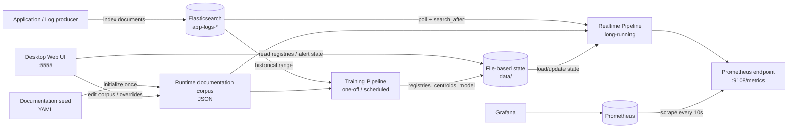
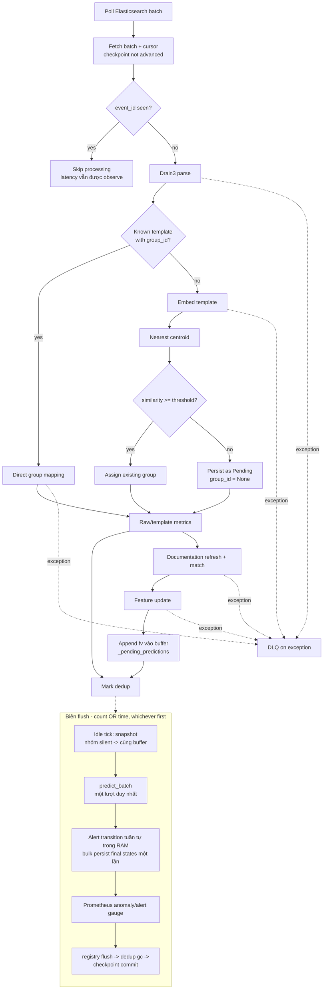
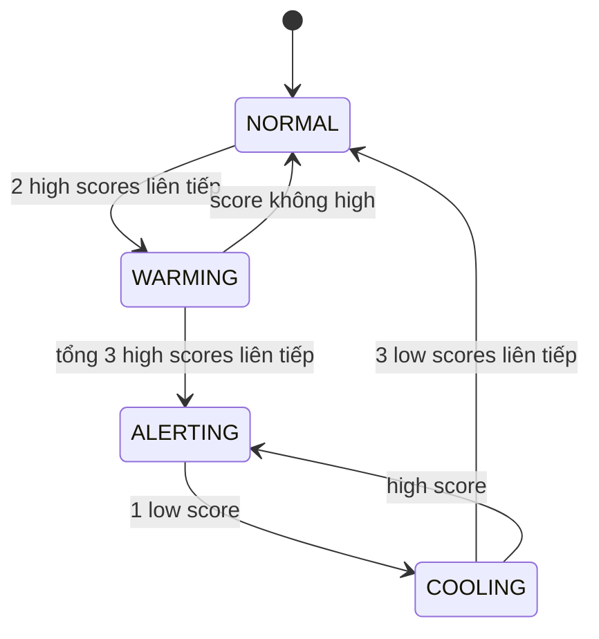

# LogAI Engine Architecture

Tài liệu này mô tả kiến trúc **đang được triển khai trong code** tại ngày
2026-09-08. Khi tài liệu và code khác nhau, code là nguồn xác nhận behavior
thực tế; sai lệch phải được cập nhật lại tại đây và trong
`KNOWN_ISSUES.md`/`ISSUES_FIXED.md`.

## 1. Mục tiêu và phạm vi

LogAI Engine đọc application logs từ Elasticsearch, chuẩn hóa message thành
template, gom các template tương tự thành semantic group, đối chiếu group với
documentation corpus, phát hiện bất thường theo lưu lượng log và xuất kết quả
qua Prometheus.

Hệ thống gồm hai workflow độc lập nhưng dùng chung artifacts:

- **Training**: batch/offline, tạo template registry, group registry,
  centroids, documentation matches và Global Isolation Forest.
- **Realtime**: long-running, poll log mới, dùng artifacts đã train để assign,
  predict và xuất metrics. Realtime không chạy HDBSCAN và không retrain model.

Ngoài phạm vi hiện tại:

- Thu thập log trực tiếp từ file, Kafka hoặc agent khác Elasticsearch.
- Giao diện truy vấn REST/GraphQL cho kết quả phân tích.
- Tự động gửi notification; hệ thống chỉ xuất alert state qua metrics.
- Multi-instance active-active trên cùng state directory.
- Quản lý vòng đời/replay DLQ tự động.

## 2. System context



Trong Docker Compose, Elasticsearch, LogAI Engine, Prometheus và Grafana chạy
thành bốn services. Volume `logai-data` giữ artifacts qua restart container.

## 3. Nguồn cấu hình và thứ tự ưu tiên

`logai/config.py` định nghĩa các dataclass cấu hình. Giá trị được resolve theo
thứ tự sau, lớp sau ghi đè lớp trước:

1. Default trong dataclass.
2. File YAML, mặc định là `config.yaml`.
3. Environment variables được hỗ trợ trực tiếp.

Environment overrides hiện có:

| Variable | Đích |
|---|---|
| `LOGAI_ES_HOSTS` | `elasticsearch.hosts`, phân tách bằng dấu phẩy |
| `LOGAI_ES_USER` | `elasticsearch.username` |
| `LOGAI_ES_PASSWORD` | `elasticsearch.password` |
| `LOGAI_METRICS_PORT` | `metrics.http_port` |
| `LOGAI_METRICS_HOST` | `metrics.http_host` |
| `LOGAI_STORAGE_BASE_DIR` | Storage base, model directory, Drain3 path và ba documentation runtime paths |
| `LOGAI_DOCUMENTATION_CORPUS_PATH` | Override riêng `doc_matcher.corpus_path` sau storage base |
| `LOGAI_EMBEDDING_ENDPOINT` | Required remote embedding HTTP endpoint |
| `LOGAI_EMBEDDING_API_FORMAT` | `openai` or `tei` response contract |
| `LOGAI_EMBEDDING_API_KEY` | Optional bearer token |
| `LOGAI_EMBEDDING_MODEL` | Remote model identifier, default `BAAI/bge-m3` |
| `LOGAI_EMBEDDING_DIMENSION` | Expected dense-vector dimension, default `1024` |
| `LOGAI_EMBEDDING_BATCH_SIZE` | Maximum texts sent per request |
| `LOGAI_EMBEDDING_TIMEOUT_SECONDS` | Per-request HTTP timeout |
| `LOGAI_EMBEDDING_MAX_RETRIES` | Retry count for transient failures |
| `LOGAI_LLM_ENDPOINT` | OpenAI-compatible `/chat/completions` URL cho LLM incident classification; rỗng = tắt |
| `LOGAI_LLM_API_KEY` | Optional bearer token cho LLM endpoint |
| `LOGAI_LLM_MODEL` | Model name gửi trong request LLM |

Các cấu hình khác chỉ thay đổi qua YAML hoặc code. `ReliabilityConfig` có các
giá trị retry, nhưng decorator của Elasticsearch collector hiện dùng trực tiếp
default của `retry_with_backoff`; các giá trị `reliability.max_retries` và
`backoff_*` chưa được truyền vào collector.

Historical training sử dụng section `training` trong `config.yaml` cho
`batch_size`, `max_docs`, `lookback_seconds` và `dedup_buffer_size`. CLI chỉ
override `lookback_seconds` khi truyền `--lookback-hours`; các giá trị còn lại
được lấy từ file config.

## 4. External input contract

### 4.1 Elasticsearch document

Log producer ghi document vào index khớp `elasticsearch.index`, mặc định
`app-logs-*`.

```json
{
  "@timestamp": "2026-09-07T10:00:01Z",
  "service": "payment",
  "level": "ERROR",
  "message": "DB connection timeout host=10.0.0.1",
  "trace_id": "7dcfe15c",
  "host": "payment-01"
}
```

| Field | Kiểu được code chấp nhận | Bắt buộc thực tế | Default/behavior |
|---|---|---:|---|
| `@timestamp` | ISO8601 string hoặc number | Nên có | Thiếu/không parse được thì dùng thời gian xử lý hiện tại |
| `service` | string | Không | `"unknown"` |
| `level` | string | Không | `"INFO"` |
| `message` | string | Không | `""` |
| field khác | JSON-compatible | Không | Được giữ trong `RawLog.metadata` |

Quy ước quan trọng:

- ISO8601 có hậu tố `Z` được đổi thành `+00:00` rồi parse.
- Number hiện được hiểu trực tiếp là **epoch seconds**. Epoch milliseconds
  chưa được normalize và không nên gửi ở trạng thái code hiện tại.
- `event_id` nội bộ lấy từ Elasticsearch `_id`, không lấy từ payload.
- Collector hiện gán `es_index` bằng index pattern cấu hình, không phải
  `_index` thật của hit.
- Dedup chỉ dùng `_id`; hai document ở hai index khác nhau nhưng trùng `_id`
  có thể bị xem là cùng event.
- Query realtime sort theo `@timestamp` tăng dần rồi `_id` tăng dần. Index phải
  có mapping tương thích với sort này.

### 4.2 Documentation corpus

`docs/documentation_corpus.yaml` là seed chỉ dùng ở lần khởi tạo đầu tiên.
Runtime source of truth là `data/documentation_corpus.json`, được quản lý qua
Template Explorer. `data/documentation_overrides.json` lưu lựa chọn document
thủ công theo group; lựa chọn này thắng automatic cosine match cho tới khi bị
xóa. Engine kiểm tra revision mỗi 5 giây và cập nhật Group Registry mà không
restart hay retrain anomaly model.

```yaml
- id: DOC-DB-001
  title: Database connection timeout
  text: Database connection timeout while connecting to the primary database.
  error_code: ERR_DB_TIMEOUT
```

| Field | Kiểu | Bắt buộc | Vai trò |
|---|---|---:|---|
| `id` | string/coercible to string | Có | Stable documentation identifier |
| `title` | string | Không | Metadata hiển thị; default rỗng |
| `text` | string | Có | Nội dung dùng để tạo embedding |
| `error_code` | string | Không | Ghi vào `GroupState` khi match thành công |

Document tạo qua API nhận ID tăng tuần tự (`DOC-001`, `DOC-002`, ...). Corpus
lưu bộ đếm monotonic riêng nên ID đã xóa không được tái sử dụng; ID từ seed và
legacy corpus được giữ nguyên. Bộ đếm không tham gia corpus revision vì không
thay đổi nội dung dùng cho matching.

Corpus hiện là dữ liệu demo và phải được thay bằng runbook/knowledge base thật
trước production.

Web mutation dùng optimistic revision. Hai browser cùng sửa một snapshot sẽ
nhận HTTP 409 thay vì ghi đè lẫn nhau. Mọi file được ghi qua temporary file và
`os.replace`. Document đang được bất kỳ active group nào sử dụng (manual hoặc
automatic) không thể bị xóa cho tới khi assignment được đổi hoặc clear. Override
lưu fingerprint của group membership để audit, nhưng manual assignment là intent
gắn với group ID và không bị suspend khi membership thay đổi. Documentation
mutation bị chặn trong lúc grouping revision chưa apply để không ghi từ snapshot cũ.

## 5. Core data contracts

Các schema dưới đây là dataclass trong `logai/models.py`.

### 5.1 RawLog

Output chuẩn hóa của collector và input của parser.

| Field | Kiểu | Ý nghĩa |
|---|---|---|
| `timestamp` | `float` | Epoch seconds UTC |
| `service` | `str` | Tên service sinh log |
| `level` | `str` | Log level |
| `message` | `str` | Raw message |
| `metadata` | `Dict[str, Any]` | Các field Elasticsearch còn lại |
| `event_id` | `str` | Elasticsearch `_id` |
| `es_index` | `Optional[str]` | Hiện là configured index pattern |
| `es_doc_id` | `Optional[str]` | Elasticsearch `_id` |

### 5.2 ParsedEvent

Output của Drain3 parser.

| Field | Kiểu | Ý nghĩa |
|---|---|---|
| `raw` | `RawLog` | Event gốc |
| `template_id` | `str` | `T` + Drain3 cluster ID, zero-padded 5 chữ số |
| `template` | `str` | Message template chứa wildcard `<*>` |
| `parameters` | `List[str]` | Giá trị wildcard trích xuất best-effort |
| `is_new_template` | `bool` | `true` khi Drain3 tạo cluster mới |

Parameter extraction chỉ hoạt động khi số token của template và message bằng
nhau. Nếu không, `parameters` là list rỗng.

### 5.3 TemplateState

Metadata persisted theo `template_id`.

| Field | Kiểu | Default | Ý nghĩa |
|---|---|---|---|
| `template_id` | `str` | bắt buộc | Registry key |
| `template_text` | `str` | bắt buộc | Template mới nhất |
| `service` | `str` | bắt buộc | Service gắn với template |
| `level` | `str` | `"INFO"` | Level **nặng nhất từng ghi nhận** của template (monotonic, không bao giờ tụt cấp). Xếp hạng theo `LEVEL_RANK`; `WARN`/`WARNING` cùng hạng, `FATAL`/`CRITICAL` cùng hạng. Level lạ (không có trong `LEVEL_RANK`) được xử lý ở hạng `INFO` nên không bao giờ lấn át `ERROR`. Có default để `template_registry.json` cũ (sinh trước khi có field này) vẫn load được. |
| `module` | `str` | `""` | Chưa được pipeline populate |
| `first_seen` | `float` | current time | Event sớm nhất |
| `last_seen` | `float` | current time | Event gần nhất |
| `event_count` | `int` | `0` | Tổng event đã ghi nhận |
| `group_id` | `Optional[str]` | `None` | Semantic group hoặc pending |

`DEFAULT_LEVEL` và `LEVEL_RANK` là hằng số module-level trong `logai/models.py`;
việc promote level được viết inline tại các call site (không có helper trung gian).

### 5.4 GroupState

Metadata persisted theo `group_id`.

| Field | Kiểu | Default | Ý nghĩa |
|---|---|---|---|
| `group_id` | `str` | bắt buộc | Registry key |
| `service` | `str` | `""` | Service của representative template |
| `module` | `str` | `""` | Chưa được pipeline populate |
| `template_ids` | `List[str]` | `[]` | Templates thuộc group |
| `representative_template` | `str` | `""` | Template đại diện |
| `error_code` | `str` | `""` | Error code từ documentation match |
| `documented` | `bool` | `false` | Có vượt doc similarity threshold |
| `documentation_id` | `Optional[str]` | `None` | ID tài liệu match tốt nhất |
| `confidence` | `float` | `0.0` | Cosine similarity với documentation |
| `documentation_source` | `str` | `"automatic"` | Nguồn match: `automatic`, `manual`, `stale_override` (document không còn trong corpus), hoặc `none` |
| `severity` | `str` | `"unknown"` | Chưa được pipeline populate |
| `first_seen` | `float` | current time | Mốc sớm nhất của group |
| `last_seen` | `float` | current time | Mốc gần nhất của group |
| `event_count` | `int` | `0` | Tổng event của group |
| `active` | `bool` | `true` | Chưa có lifecycle tự động thay đổi |

Training aggregate `event_count`, `first_seen`, `last_seen` từ
`TemplateRegistry`, có độ phức tạp O(T) theo số template thay vì O(N) theo số
event. Với group chứa nhiều service, service của template đầu tiên được chọn.

### 5.5 GroupedEvent

| Field | Kiểu | Ý nghĩa |
|---|---|---|
| `parsed` | `ParsedEvent` | Event đã parse |
| `group_id` | `str` | Group được assign |
| `group_similarity` | `float` | `1.0` với known template, cosine similarity với template mới |

### 5.6 FeatureVector

Vector model vẫn có tám chiều, không chứa volume tuyệt đối và không dùng
normalizer riêng. `count_1m` đi kèm `FeatureVector` dưới dạng metadata để gate
alert nhưng bị loại khỏi `as_vector()`. Baseline được tính từ lịch sử trước khi
append sample mới và các tỷ lệ có numerical guards.

`FeatureVector.group_id` là **`Tuple[str, str]` = `(service, group_id)`**: cửa sổ
trượt được tách theo từng service trong cùng một semantic group, để baseline rate
của một service không bị trung bình lẫn với các service khác cùng group. Đây là
nhãn định danh, **không** phải feature — `as_vector()` vẫn đúng 8 chiều. Khi ghi
xuống `anomaly_state.json`, tuple được flatten thành chuỗi JSON-list duy nhất tại
seam của `AlertStateMachine` (`group_id_key`), vì JSON object không cho key là tuple.

| Field | Công thức/ý nghĩa | Clipping |
|---|---|---|
| `z_score_10s` | `(rate_10s - mu10) / (sigma10 + eps)`; độ lệch chuẩn hóa 10s | `[-10, 10]` |
| `z_score_1m` | `(rate_1m - mu1m) / (sigma1m + eps)`; độ lệch chuẩn hóa 1m | `[-10, 10]` |
| `short_growth_rate` | `rate_10s / max(rate_1m, rate_floor)`; tỷ lệ tăng trưởng tức thì 10s vs 1m | `[0, 6]` |
| `growth_rate` | `rate_1m / (rate_5m + eps)`; tỷ lệ tăng trưởng 1m vs 5m | `[0, 5]` |
| `burstiness_10s` | `sigma10^2 / max(mu10, rate_floor)^2`; CV^2 có sàn cho baseline thưa | `[0, 20]` |
| `rate_delta_norm` | `(rate_1m - rate_5m) / (sigma1m + eps)` | `[-10, 10]` |
| `slope_norm` | Linear slope của rate 1m history chia mu1m | `[-10, 10]` |
| `spike_ratio_10s` | Max recent 10s rate chia `max(mu10, rate_floor)` | `[0, 20]` |

`FeatureVector.as_vector()` luôn trả feature theo đúng thứ tự trên. Event đầu
của group tạo neutral baseline `[0, 0, 1, 1, 0, 0, 0, 1]`.

### 5.7 AnomalyResult và AnomalyState

`AnomalyResult` là output stateless của model:

| Field | Kiểu | Ý nghĩa |
|---|---|---|
| `group_id` | `Tuple[str, str]` | Cửa sổ `(service, group_id)` được predict (echo từ FeatureVector) |
| `timestamp` | `float` | Timestamp của feature vector |
| `anomaly_score` | `float` | Score clamp trong `[0, 1]` |
| `anomaly` | `bool` | IF outlier hoặc score vượt threshold |
| `model_version` | `str` | Hiện là `if-global-v3` |
| `count_1m` | `int \| None` | Metadata volume; không phải chiều model |

`AnomalyState` bổ sung `consecutive_anomaly_count` và `alert_state` để persist
hysteresis theo cửa sổ `(service, group_id)`. Alert states gồm `NORMAL`,
`WARMING`, `ALERTING`, `COOLING`.

Điểm cao chỉ được phép leo thang alert khi `count_1m >=
alert.min_events_1m`. **Vì cửa sổ giờ tách theo service, ngưỡng volume này áp
dụng trên số event của RIÊNG service đó trong một phút**, không phải tổng group —
một service ít log trong group nhiều service có thể dưới ngưỡng và không leo thang
(ngưỡng `min_events_1m` cần tune lại theo tỉ lệ số service). Điểm từ mẫu thiếu
volume vẫn được export để quan sát, nhưng state machine coi mẫu đó là tín hiệu phục
hồi. `count_1m=None` giữ hành vi cũ cho caller không cung cấp metadata.

`WindowState` cũng được khai báo trong models nhưng hiện không được pipeline sử
dụng hoặc persist.

## 6. Training pipeline

Entry point: `scripts/run_training.py`.


### 6.1 Trình tự xử lý

| Bước | Module | Input | Output/state |
|---:|---|---|---|
| 1 | `ElasticsearchCollector.stream_historical_batches` | `start_ts`, `end_ts`, `max_docs`, `batch_size`, cursor | Iterator của `(List[RawLog], cursor)` |
| 2 | `Drain3Parser` | Raw logs sorted theo timestamp, từng batch | Drain3 state + durable training event index |
| 3 | `TrainingPipeline._rebuild_template_registry` | Durable event index | Template metadata (kèm `level` = max severity các event của template) |
| 4 | `TemplateEmbedder` | Template texts | L2-normalized vectors |
| 5 | `GroupClusterer.cluster` | Template IDs + embedding matrix | HDBSCAN labels |
| 6 | `TrainingPipeline._cluster_templates` | Labels | `template_id -> group_id` |
| 7 | `TrainingPipeline._build_group_registry` | Mapping + Template Registry | Group metadata |
| 8 | `GroupClusterer.compute_centroid` | Embeddings trong group | L2-normalized centroid |
| 9 | `DocumentationMatcher.match_all` | Group centroids | Match metadata trong Group Registry |
| 10 | `TrainingPipeline._group_events` | Event index + `template_id -> group_id` | Bucket timestamps theo `(service, group_id)` |
| 11 | `FeatureEngine` (per window) | Events của từng `(service, group)`, chronological | `FeatureVector` list (8 chiều) |
| 12 | `GlobalAnomalyModel.train` | Feature vectors replay từ event index | `models/global_v3.pkl` |

Toàn bộ cửa sổ feature/alert được tách theo service: `_group_events` gộp event theo
`(service, group_id)` (service đã có sẵn trong mỗi event-index record, không cần dữ
liệu mới) rồi `_train_anomaly_models` feed từng cửa sổ đó qua `FeatureEngine.update`.
Nhánh clustering (`_cluster_templates`/`_build_group_registry`/centroids) **vẫn gom
templates cross-service như cũ** - chỉ có đồng hồ rate là tách theo service.

### 6.2 Group ID rules

- HDBSCAN cluster label `n` trở thành `Gnnnn`, ví dụ `G0002`.
- Noise label `-1` tạo singleton group `G_SINGLE_nnnn`.
- Group IDs phụ thuộc kết quả clustering và thứ tự template, nên không được bảo
  đảm ổn định qua các lần retraining.
- Template ID ổn định qua restart phụ thuộc việc giữ nguyên
  `drain3_state.bin`.

### 6.3 Điều kiện tạo model

Global model chỉ được fit khi tổng số feature vectors không nhỏ hơn
`anomaly.min_training_samples`, mặc định 30. Nếu không đủ mẫu, training vẫn ghi
registries nhưng không tạo model mới; realtime sẽ bỏ qua anomaly prediction nếu
không tìm thấy `models/global_v3.pkl`.

## 7. Realtime pipeline

Entry point: `scripts/run_realtime.py`.

Suy luận anomaly được **micro-batch** (TODO #7): mỗi event chỉ parse/group/feature
rồi **append `(window_key, FeatureVector)`** vào buffer `_pending_predictions`,
trong đó `window_key = (service, group_id)`; toàn bộ buffer được chấm bằng **một**
`predict_batch` tại **biên flush** (xem §7.5).
Luồng per-event (hộp liền) và luồng flush (hộp nét đứt bên dưới) là hai giai đoạn
tách biệt trong cùng vòng lặp poll.



### 7.1 Known template path (Fast-path)

Nếu `TemplateRegistry` đã có template và `group_id`:

1. Không tạo embedding mới (bỏ qua remote BGE-M3 request).
2. Không cluster hay so khớp centroids (bỏ qua HDBSCAN/Centroids).
3. Không tính toán lại template metrics (bỏ qua `_update_template_metrics`).
4. Cập nhật template `last_seen`, `event_count`, và promote `level` nếu event có
   severity cao hơn (monotonic).
5. Cập nhật group `last_seen`, `event_count`.
6. Chạy documentation match, feature generation (8D dimensionless vector) rồi
   **append feature vector vào buffer** `_pending_predictions`. Prediction
   (`if-global-v3`) và alert **không** chạy tại đây — được dời sang biên flush
   theo batch (§7.5).

`group_similarity` được đặt là `1.0` để biểu thị direct mapping, không phải
cosine similarity được tính lại.

### 7.2 Unknown/pending template path

Nếu template mới hoặc chưa có `group_id`:

1. Tạo embedding cho template qua `embedder.embed_one()`.
2. So cosine similarity với tất cả group centroids.
3. Nếu best score đạt `assignment_similarity_threshold`, gắn template vào
   group gần nhất.
4. Nếu không đạt, lưu template với `group_id = None` và chờ training tiếp theo.
5. Khi lưu template vào `TemplateRegistry`, hàm `upsert()` xác định liệu đây có
   phải template mới toanh (`is_new=True`) hay không. Nếu `is_new=True`, pipeline
   kích hoạt `_update_template_metrics()` cập nhật Prometheus gauge
   `app_log_templates_total{service}` thông qua bộ đếm $O(1)$ trong RAM. Template
   mới được khởi tạo `level` bằng level của chính event đó (đã `.upper()`).
6. Nếu template đã tồn tại (ví dụ đã lưu Pending ở sự kiện trước), `is_new=False`
   và không tăng đếm trùng lặp; `level` vẫn được promote nếu event mới có severity
   cao hơn.

Pending event vẫn được tính raw metrics và mark dedup processed, nhưng
không có feature vector, anomaly score hoặc alert state.

### 7.3 Documentation refresh

Corpus được reload khi khoảng thời gian từ lần refresh gần nhất vượt
`doc_matcher.refresh_interval_seconds`, mặc định 300 giây. Reload hiện embed lại
toàn bộ corpus và ghi `doc_embeddings.pkl`; persisted cache chưa được đọc để
tránh recompute.

### 7.4 Anomaly và alert

Isolation Forest trả `decision_function` với giá trị cao hơn là bình thường.
Engine chuyển thành:

```text
anomaly_score = clamp(0.5 - decision_function, 0, 1)
```

`AnomalyResult.anomaly` là true nếu `decision_function < 0` (tương đương chính xác
IF `predict() == -1`, nên lời gọi `predict()` thừa đã bị bỏ — xem §7.5) hoặc score
đạt `score_alert_threshold`. Alert state machine dùng trực tiếp `score_high` và
`score_low`, không dùng boolean `anomaly` để transition.

Với default config:



Score nằm giữa `score_low` và `score_high` reset countdown tương ứng nhưng không
luôn thay đổi state.

### 7.5 Micro-batch inference ở phase predict (TODO #7)

Per-event predict là điểm nghẽn CPU chính (~6 ms/log, trần ~165 logs/s), vì mỗi
event chấm một ma trận `(1, 8)` và `predict()` cũ duyệt rừng **2 lần**
(`decision_function` **và** `model.predict`). Giải pháp: gom feature vector qua các
poll rồi chấm **một lượt**.

- **`GlobalAnomalyModel.predict_batch(fvs) -> List[Optional[AnomalyResult]]`**: gom
  các vector hợp lệ thành `X = (N, 8)`, gọi `decision_function(X)` **đúng 1 lần**;
  output cùng thứ tự & độ dài input, chèn `None` cho vector chưa-train/sai-chiều.
  `predict()` đơn ủy quyền `predict_batch([fv])[0]` (một code path). Đo thực tế:
  batch 500 vector ~0.0045s (≈111.000 logs/s).
- **Hai ngưỡng flush config được (whichever-first)**: flush khi buffer đạt
  `anomaly.predict_batch_size` (mặc định 500) **HOẶC** đã đợi
  `anomaly.predict_max_wait_seconds` (mặc định 1.0s) kể từ entry đầu. Vòng lặp ngủ
  `min(poll_interval, thời-gian-còn-lại)` để timer 1s luôn hiệu lực;
  `elasticsearch.poll_interval_seconds` hạ 5→1 để nhịp thức ≤ max_wait.
- **Idle-tick gộp chung buffer**: mỗi `alert.idle_eval_seconds`, các **cửa sổ
  `(service, group)`** cần re-evaluate được `snapshot()` và append vào **cùng**
  buffer, chấm chung một `predict_batch`. Tập cửa sổ = `alert_sm.groups_not_normal()`
  (non-NORMAL, **persist** qua restart) ∪ `feature_engine.live_window_keys()` (mọi
  cửa sổ đang có window, để refresh NORMAL). **Silence guard là PER-CELL** qua
  `feature_engine.last_event_ts(cell)`: chỉ bỏ qua cửa sổ còn nhận log (per-event
  path đang sở hữu nó), nên một service im lặng nằm trong group có service khác vẫn
  đang bắn vẫn được làm mát. Một cell non-NORMAL chưa có window sau restart có
  `last_event_ts() is None` → vẫn được snapshot → vector trung tính → cool-down.
- **Tương đương per-event 100%**: giữ **một entry / EVENT** (không collapse theo
  group), `transition_batch()` apply theo đúng thứ tự trong RAM và trả mọi state
  trung gian cho metrics. Chỉ final state của mỗi **cửa sổ** được `bulk_set()` một
  lần xuống `anomaly_state.json` (key là tuple flatten), tránh serialize toàn file
  cho từng event.
- **Crash-safety**: `_flush_batch()` giữ nguyên thứ tự durability — predict+apply
  → registry flush → `dedup.gc()` → `checkpoint.commit()` (chỉ khi có cursor thật
  từ stream). Chi tiết ở §10.3.

### 7.6 LLM incident classification

Bật khi `llm.endpoint` (`LOGAI_LLM_ENDPOINT`) khác rỗng; khi rỗng realtime chạy y
như trước.

- **Trigger**: sau `transition_batch()`, mỗi cửa sổ `(service, group_id)` vừa vào
  ALERTING ở một *episode* mới được `submit` một lần. Episode chỉ kết thúc khi về
  NORMAL; COOLING → ALERTING không trigger lại. Khi khởi động, các cửa sổ đang
  ALERTING/COOLING trong `anomaly_state.json` được coi là đã phân tích (restart
  không trigger lại).
- **Evidence**: templates của group (ưu tiên cùng service, tối đa 10), trạng thái
  alert, top giá trị parameter theo slot từ 200 event gần nhất của cửa sổ (bỏ
  `<*>`; số/ID đã bị preprocessor mask nên không rời cluster), và top-k tài liệu
  gần nhất theo cosine với centroid (`DocumentationMatcher.top_k`).
- **Thực thi**: daemon thread `IncidentClassifier` với queue bounded 100; poll loop
  không bao giờ chờ LLM. Retry 408/429/5xx; mọi lỗi được ghi `status=failed`,
  không raise vào engine. Metric `logai_llm_requests_total{result}`.
- **Hallucination guard**: `documentation_id` không thuộc danh sách candidate bị
  coi là `null`; khi không có tài liệu hợp lệ thì bắt buộc có `suggestion`.
- **Ownership**: `data/incident_analysis.json` chỉ engine ghi; web chỉ đọc và gắn
  vào `/api/alerts` (`analysis`). Kết quả là tư vấn, không ghi vào field
  documentation của `GroupState`. Suggestion có thể lưu thành tài liệu mới qua
  nút "Save as document" (dùng `POST /api/documentation` sẵn có).

### 7.7 On-demand service analysis

Phân tích toàn bộ một service theo yêu cầu (mọi alert state), chạy trên cùng
worker `IncidentClassifier` như một loại job thứ hai.

- **Request**: Web UI (panel "Service analysis" trong tab Alerts) gọi
  `POST /api/service-analysis {service}`; web ghi `data/analysis_requests.json`
  (`{service: requested_at}`, web là writer duy nhất, entry > 24h bị bỏ). Trả về
  404 service lạ, 503 engine heartbeat cũ, 409 `llm_disabled` (heartbeat
  `runtime.llm_enabled=false`), 409 `analysis_pending`.
- **Pickup**: mỗi vòng poll, engine đọc lại file khi mtime đổi và submit mỗi
  request đúng một lần: `requested_at` phải mới hơn cả bản đã xử lý trong RAM lẫn
  `requested_at` của record đã lưu (an toàn khi restart). Service không có
  template/cửa sổ nào bị bỏ qua.
- **Evidence** (`logai/incident/service_analysis.py`): các group có template của
  service hoặc có cửa sổ alert `(service, g)`; xếp theo alert state → level cao
  nhất → event count, tối đa 20 group; mỗi group 3 template và top parameter;
  candidate docs = top 3/group từ embeddings, khử trùng, tối đa 15.
- **Kết quả**: `{health: healthy|degraded|critical|unknown, summary, issues[≤10]}`;
  mỗi issue chỉ được tham chiếu group/doc đã gửi, issue không có doc hợp lệ lẫn
  suggestion bị loại. Lưu ở `data/service_analysis.json` (chỉ engine ghi, key là
  service); web chỉ đọc qua `GET /api/service-analysis`.

### 7.8 LLM profiles

Nguồn LLM (endpoint / api_key / model) được quản lý từ Web UI (view "LLM
profiles"), không cần sửa env hay restart.

- **Lưu trữ**: `data/llm_profiles.json`, chỉ web ghi (atomic, mode `0600` vì chứa
  API key). API không bao giờ trả key về browser, chỉ trả `api_key_hint`
  (vd `sk-…W7h`); sửa profile mà để trống key thì giữ key cũ.
- **Endpoint**: nhập base URL (`https://host` hoặc `.../v1`) sẽ được chuẩn hóa thành
  `.../v1/chat/completions`; path khác được giữ nguyên.
- **Active profile**: một profile active cho toàn hệ thống (`PUT
  /api/llm-profiles/active`). Engine đọc lại mỗi vòng poll và đổi `LLMConfig` của
  `IncidentClassifier` tại chỗ; `null` = dùng cấu hình env `LOGAI_LLM_*` (server
  default). Không có profile và không có env endpoint ⇒ phân tích LLM tắt.
- **Heartbeat** runtime báo `llm_enabled` và `llm_profile_id` (không có key) để UI
  hiển thị profile engine đang thực sự dùng.
- **Không có xác thực**: ai truy cập được Web UI đều có thể tạo/đổi profile (và do
  đó chuyển hướng log evidence tới endpoint khác). Chỉ expose UI trong mạng tin cậy.
  Engine cũng sẽ POST tới bất kỳ host nào được nhập (kể cả địa chỉ nội bộ — SSRF);
  nếu cần siết lại, thêm allowlist host qua env. Đổi host của một profile bắt buộc
  nhập lại API key, để key đã lưu không bị gửi tới host mới.

## 8. Module ownership và boundary mapping

| Module | Trách nhiệm | Input | Output | State sở hữu |
|---|---|---|---|---|
| `logai/config.py` | Load và merge cấu hình | YAML + environment | `AppConfig` | Không |
| `logai/models.py` | Data contracts dùng chung | Field values | Dataclass instances | Không |
| `collector/es_collector.py` | Poll realtime và stream historical | ES config + checkpoint | `RawLog` batches/cursor | Realtime hoặc training cursor qua CheckpointStore |
| `parsing/drain3_parser.py` | Mine template và extract parameters | `RawLog` | `ParsedEvent` | `drain3_state.bin` |
| `embedding/embedder.py` | Encode text thành normalized vector | Template/doc text | NumPy matrix/vector | Model in-memory/Hugging Face cache |
| `clustering/hdbscan_cluster.py` | Offline clustering, centroid, realtime nearest-group | IDs + vectors | Labels, centroid, assignment | Không |
| `docmatch/doc_matcher.py` | Load runtime corpus và cosine match | JSON corpus + centroids | `MatchResult` | Corpus/embeddings in-memory + cache file |
| `docmatch/refresh_worker.py` | Theo dõi revision và refresh group documentation | Corpus + overrides + registries | Group documentation updates | `documentation_status.json` |
| `features/feature_engine.py` | Sliding-window aggregation | `(service, group_id)`, timestamp | `FeatureVector` | Per-`(service, group)` windows in-memory |
| `anomaly/isolation_forest_model.py` | Train/load/predict global IF | Feature vectors | `AnomalyResult` | `models/global_v3.pkl` + in-memory model |
| `alert/alert_state_machine.py` | Hysteresis theo group | `AnomalyResult` | `AnomalyState` | `anomaly_state.json` |
| `metrics/prometheus_exporter.py` | Expose/update metrics | Parsed/group/anomaly state | `/metrics` | Prometheus client in-memory |
| `storage/base.py` | Atomic JSON/pickle/model persistence | Python objects | Files | File contents |
| `storage/registries.py` | Template/group metadata và vectors | State dataclasses/vectors | Registry lookup/list | Registry files + caches |
| `storage/documentation.py` | Validate/revision/persist corpus và manual overrides | JSON mutation payloads + YAML seed | Versioned corpus/override snapshots | Documentation JSON files |
| `storage/checkpoint.py` | Persist Elasticsearch cursor | sort values/timestamp | Current checkpoint | `checkpoint.json` hoặc `training_checkpoint.json` |
| `storage/dedup.py` | Event idempotency theo TTL | `event_id` | seen/not seen | `dedup_index.json` |
| `reliability/retry.py` | Exponential backoff + jitter | Callable | Result hoặc re-raised error | Không |
| `reliability/dlq.py` | Ghi và đọc failed events | Payload + error | JSONL records | `dlq.jsonl` |
| `training/train_pipeline.py` | Orchestrate batch training | Historical `RawLog` list | Training artifacts | Qua registries/model stores |
| `realtime/realtime_pipeline.py` | Orchestrate streaming processing | Realtime batches | Metrics + updated state/DLQ | Qua component stores |
| `web/app.py` | Desktop UI API và documentation mutations | Registry/state files + HTTP requests | JSON API + static UI | Corpus/override files qua `DocumentationCorpusStore` |

Ownership rule: orchestrator quyết định thứ tự và nhánh xử lý; module chuyên
biệt không được tự gọi ngược orchestrator. `models.py` và `config.py` là shared
contracts, không chứa business workflow.

## 9. External output contracts

### 9.1 Prometheus metrics

Endpoint mặc định: `http://<host>:9108/metrics`.

| Metric | Type | Labels | Update semantics |
|---|---|---|---|
| `app_log_events_total` | Counter | `service` | Tăng sau parse/assign thành công |
| `app_log_errors_total` | Counter | `service`, `error_code` | Tăng với level ERROR/CRITICAL/FATAL; `error_code` hiện là `template_id` |
| `app_log_templates_total` | Gauge | `service` | Số template của service; hiện scan toàn registry mỗi event |
| `log_anomaly_score` | Gauge | `service`, `group_id`, `documented` | Score gần nhất của cửa sổ `(service, group)`; ghi tại biên flush micro-batch (§7.5) |
| `log_alert_state` | Gauge | `service`, `group_id`, `state` | State hiện tại bằng 1, ba state còn lại bằng 0; `set_alert_state` return sớm khi state không đổi |
| `log_alerts_total` | Counter | `service`, `group_id` | Tăng một lần cho mỗi chuyển tiếp INTO `ALERTING` |
| `logai_events_received_total` | Counter | Không | Tăng `inc(len(batch))` một lần mỗi batch |
| `logai_events_processed_total` | Counter | Không | Tăng sau khi event được mark dedup |
| `logai_events_failed_total` | Counter | Không | Tăng khi event exception và được gửi DLQ |
| `logai_retry_total` | Counter | Không | Đã khai báo nhưng retry helper chưa cập nhật metric này |
| `logai_processing_latency_seconds` | Histogram | Không | Quan sát thời gian `_process_one`, kể cả failure/dedup return |
| `logai_queue_depth` | Gauge | Không | Kích thước batch trong lúc xử lý, 0 sau batch |

Prometheus scrape mỗi 10 giây theo `prometheus.yml`. Metrics client state nằm
trong memory và reset khi process restart; Prometheus giữ time series đã scrape.

### 9.2 Web UI và HTTP API

Flask web process là reader của template/group/anomaly state và là writer duy
nhất của editable documentation corpus/overrides và grouping intent. Engine là
writer duy nhất của grouping status và applied registries. Bốn view dùng hash route:
`#templates`, `#groups`, `#alerting`, `#documentation`. Sidebar và Reload luôn
hiện trên desktop; request lỗi được retry mỗi 2 giây để browser tự reconnect sau
web process restart.

`GET /api/alerts` merge `anomaly_state.json` với group/template registries. Alert
condition lấy trực tiếp từ `AnomalyState.alert_state`. Cột Level của Alerting UI
không phải field của group và không tham gia state machine; API derive nó từ
template level nặng nhất trong service/group cell để cung cấp display context.
Alerting view chỉ poll mỗi 2 giây khi đang active.

Documentation mutations dùng optimistic revision và trả 409 khi client ghi từ
snapshot cũ hoặc grouping revision chưa apply. Assignment endpoint ghi override
với fingerprint audit của group rồi trả `state: pending`; refresh worker áp dụng
revision bất đồng bộ. Manual override hợp lệ tiếp tục gắn với group ID khi
membership thay đổi. API không có auth, vì vậy deployment phải chặn write routes
bằng ingress/network policy.

`PUT /api/templates/<id>/group` ghi desired assignment và trả `202`; engine
flush prediction cũ rồi activate revision tại poll/batch boundary. `GET
/api/grouping/status` phân biệt pending, partial, applied, failed và
engine_unavailable. `GET /api/health` dùng heartbeat thay vì chỉ kiểm tra port.

Chi tiết endpoint, payload, response và hành vi UI nằm tại
[`docs/WEB_UI.md`](docs/WEB_UI.md).

### 9.3 Persistent artifacts

| Artifact | Format | Writer | Reader | Nội dung |
|---|---|---|---|---|
| `data/template_registry.json` | JSON object | Training + realtime | Training + realtime | `template_id -> TemplateState` (kèm in-memory $O(1)$ Counter theo service) |
| `data/template_embeddings.pkl` | Pickle | Training + realtime | Training + realtime | `template_id -> numpy vector` |
| `data/group_registry.json` | JSON object | Training + realtime | Training + realtime | `group_id -> GroupState` |
| `data/group_centroids.pkl` | Pickle | Training | Training + realtime | `group_id -> normalized centroid` |
| `data/models/global_v3.pkl` | Pickle | Training | Realtime | Global Isolation Forest với rate-floor features |
| `data/doc_embeddings.pkl` | Pickle | Doc matcher | Hiện chưa được reuse khi reload | Corpus entries + embeddings |
| `data/drain3_state.bin` | Drain3 persistence | Parser | Parser | Drain tree/template clusters |
| `data/checkpoint.json` | JSON object | Collector | Collector | `search_after`, `last_timestamp` |
| `data/training_checkpoint.json` | JSON object | Training pipeline | Training collector | Historical `search_after` cursor |
| `data/training_event_index.jsonl` | Append-only JSONL | Training pipeline | Training pipeline | Lightweight parsed event records for replay (kèm `level`, nguồn để dựng `TemplateState.level`) |
| `data/anomaly_state.json` | JSON object | Alert state machine | Alert state machine + web API | `"[service, group_id]" -> AnomalyState` (tuple được flatten thành chuỗi JSON-list tại seam; key thường `group_id` cũ vẫn đọc được nhưng là ô mồ côi) |
| `data/documentation_corpus.json` | Versioned JSON object | Web API (seed lần đầu từ YAML) | Matcher + web API | Editable documentation source of truth |
| `data/documentation_overrides.json` | Versioned JSON object | Web API | Refresh worker + web API | Manual group assignment + group fingerprint |
| `data/documentation_status.json` | JSON object | Refresh worker | Web API | Applied/attempted revisions, stale groups, refresh error |
| `data/grouping_overrides.json` | Versioned JSON object | Web API | Training + realtime | Desired anchor/manual-group assignments |
| `data/grouping_status.json` | JSON object | Training + realtime | Web API + readiness | Applied/attempted revision, per-template results, heartbeat and progress timestamps |
| `data/dedup_index.json` | JSON object | Dedup index | Dedup index | `event_id -> processed wall-clock time` |
| `data/dlq.jsonl` | Append-only JSONL | Realtime | Manual replay API | Failed event records |
| `data/window_state.json` | Chưa dùng | Không | Không | Config placeholder |

> Lưu ý: vì `anomaly_state.json` giờ lưu theo key flatten của tuple
> `(service, group_id)`, các key `group_id` đơn thuần (trước refactor) sẽ không map
> vào cửa sổ mới. Khi deploy, **xóa `data/anomaly_state.json`** để tránh các ô cũ
> mồ côi (hàm parse giữ nguyên key chuỗi cũ nên file không crash khi đọc, nhưng
> state cũ sẽ không bao giờ được làm mát).

Pickle files chỉ được load từ nguồn tin cậy. Pickle không phải format an toàn
cho artifact do bên không tin cậy cung cấp.

### 9.4 DLQ record

```json
{
  "failed_at": 1788858000.0,
  "error": "exception message",
  "payload": {
    "timestamp": 1788857999.0,
    "service": "payment",
    "level": "ERROR",
    "message": "...",
    "metadata": {},
    "event_id": "es-document-id",
    "es_index": "app-logs-*",
    "es_doc_id": "es-document-id"
  }
}
```

`DeadLetterQueue.replay()` chỉ yield records và không xóa. `clear()` xóa toàn
bộ file; hiện không có CLI replay/clear chính thức.

## 10. Reliability semantics

### 10.1 Retry

Chỉ Elasticsearch `_search()` được bọc retry ở trạng thái hiện tại.

- Tổng cộng tối đa 1 lần gọi đầu + 5 retry.
- Backoff mặc định: 1, 2, 4, 8, 16 giây, cap 60 giây.
- Mỗi delay có random jitter từ 0% đến 10%.
- Sau khi hết retry, exception được raise ra ngoài.
- Parse, embedding, registry write, feature, model và metrics update không có
  retry riêng; lỗi của các bước này đi thẳng vào per-event exception handler.
- Elasticsearch exception sau khi hết retry xảy ra ngoài `_process_one`, nên
  không được ghi vào event DLQ và có thể làm dừng realtime loop. Docker Compose
  sẽ restart process vì policy `unless-stopped`.

### 10.2 Dedup

Realtime kiểm tra `DedupIndex.seen(event_id)` trước parse. Event thành công được
`mark()` sau toàn bộ processing.

`DedupIndex` sử dụng Bounded LRU Cache (`OrderedDict`) với dung lượng cố định
`reliability.dedup_max_size` (mặc định 200.000 entries).

- Lookup là $O(1)$, insert và eviction tự động loại bỏ phần tử cũ nhất ở đầu ở $O(1)$ amortized (`popitem(last=False)`).
- RAM tiêu thụ cố định ở mức ~20 MB (thay vì tăng không giới hạn theo log volume).
- Hàm `gc()` không còn duyệt $O(D)$, loại bỏ hoàn toàn hiện tượng pipeline stall.
- Snapshot được ghi compact JSON không indent xuống đĩa khi batch có thay đổi (`_dirty`) để phục hồi khi crash.
- Tương thích ngược với file JSON cũ định dạng dict.


### 10.3 Checkpoint và crash recovery

Realtime checkpoint gồm sort value cuối cùng và timestamp cuối cùng. Collector
chỉ trả cursor; `RealtimePipeline` commit cả hai giá trị atomically tại **biên
flush micro-batch** (§7.5), sau khi buffer đã được chấm và state đã bền vững.

Realtime xử lý batch theo at-least-once semantics. Collector không advance
checkpoint ngay sau khi fetch batch:

```text
fetch [F, G, H, I, J]
process F, G, H  (buffer feature vectors, chưa commit cursor)
process crash
restart và fetch lại [F, G, H, I, J]
dedup skip F, G, H; xử lý I, J
flush -> commit checkpoint after J
```

Vì suy luận đã batch hóa và tích lũy **qua nhiều poll**, cursor được tách khỏi
buffer: `_pending_cursor`/`_pending_last_ts` lấy từ poll của stream, còn buffer có
thể chứa cả fv-snapshot từ idle-tick (vốn không advance cursor). `_flush_batch()`
giữ **đúng thứ tự** durability và chỉ commit khi có cursor thật:

1. `_flush_predictions()` — `predict_batch`, apply transition tuần tự trong RAM,
   rồi atomic bulk persist final alert state của mỗi group đúng một lần.
2. `template_registry.flush()` → `group_registry.flush()` (no-op nếu `_dirty` sạch).
3. `dedup.gc()`.
4. `checkpoint.commit(cursor, last_ts)` — **chỉ khi `_pending_cursor is not None`**.
   Flush chỉ-idle (stream rỗng) vẫn cool-down nhưng không commit.

Mọi crash TRƯỚC bước 4 → cursor không advance; dedup mark là in-memory tới `gc`
nên batch được đọc lại và loại trùng idempotent, không mất/nhân đôi alert.

Historical training có semantics riêng: `stream_historical_batches()` không tự
ghi checkpoint. Training append và `fsync` event index trước, sau đó mới commit
cursor theo từng batch. Khi process restart, cursor xác định page kế tiếp còn
event index giữ toàn bộ dữ liệu đã parse cho các phase grouping và model. Hai file
training này chỉ bị xóa sau khi toàn bộ training artifacts được ghi thành công.

### 10.4 File atomicity và process model

`JSONStore`, `PickleStore` và `ModelStore` ghi temp file rồi `os.replace`, giúp
tránh file nửa chừng khi process crash. Lock là `threading.RLock`, chỉ bảo vệ
threads trong cùng process.

Không có file lock/distributed lock. Hai OS processes cùng ghi một artifact có
thể overwrite state của nhau. Chỉ một realtime writer được phép dùng cùng
`data/` directory.

Grouping activation uses `grouping_status.json` as a recovery marker. A pending
attempt is written before registry mutation and `applied_revision` only after
template metadata/embeddings and group metadata/centroids are durable. A crash
between file replacements is reconciled idempotently before the next event.

DLQ là append JSONL dưới thread lock nhưng không dùng temp+replace hoặc `fsync`;
record cuối có thể không bền vững nếu host mất điện đúng lúc ghi.

### 10.5 State durability theo component

| State | Durability hiện tại |
|---|---|
| Checkpoint | Commit tại biên flush micro-batch (§7.5), chỉ khi có cursor stream |
| Alert state | Flush một lần tại biên predict batch; key là `(service, group_id)` flatten; intermediate states giữ trong RAM cho metrics |
| Dedup | Flush tại biên flush qua `gc()` |
| Template/group metadata trong realtime | Update dùng `flush=False`; `flush()` tại biên flush micro-batch, no-op khi `_dirty` sạch |
| Template embeddings | Mark dirty on update; save the complete cache once at a batch/training boundary |
| Grouping intent/status | Web and engine have separate files; status heartbeat also carries last poll/event/checkpoint progress |
| Feature windows | Chỉ in-memory, key `(service, group_id)`; reset khi restart (idle-tick bù bằng cách union với alert state đã persist) |
| Prometheus client counters/gauges | Chỉ in-memory; reset khi restart |

Feature history reset làm group quay về cold-start/neutral behavior sau restart,
dù `window_state_file` đã có trong config.

## 11. Các lựa chọn thiết kế

### 11.1 Elasticsearch polling thay vì push/queue

`search_after` cho phép collector đơn giản, không cần Kafka và phù hợp MVP.
Đổi lại, throughput phụ thuộc polling/batch size, cursor commit phải được xử lý
cẩn thận và index mapping phải hỗ trợ stable sort.

### 11.2 Drain3 cho template mining

Drain3 là online parser, phù hợp cả training và realtime. Persisted tree giúp
template IDs ổn định khi restart. Nếu mất hoặc thay `drain3_state.bin`, template
IDs có thể thay đổi và làm lệch registries cũ.

### 11.3 Remote BGE-M3 semantic representation

Training and realtime call a separately deployed `BAAI/bge-m3` inference
service over HTTP. LogAI consumes the 1024-dimensional dense output and applies
L2 normalization, so dot product remains equivalent to cosine similarity. The
model weights and accelerator dependencies are owned by the inference service,
not the LogAI image. OpenAI-compatible and TEI response formats are supported.

### 11.4 Offline HDBSCAN, realtime nearest centroid

HDBSCAN chỉ chạy trong training để tránh thay đổi topology liên tục và chi phí
clustering ở realtime. Template mới chỉ được gắn vào group hiện có khi đạt
similarity threshold; template khác biệt được giữ pending đến lần training sau.

### 11.5 Một Global Isolation Forest

Một model chung giảm memory và loại cold-start model theo group. Sáu feature
dimensionless giúp so sánh hành vi giữa service có volume khác nhau. Tradeoff:
phân phối toàn cục có thể che khuất pattern đặc thù của một group, nên threshold
và contamination phải tune bằng dữ liệu thật.

### 11.6 File-based storage

JSON dễ kiểm tra, pickle phù hợp NumPy/sklearn và atomic replace đủ cho một
writer. Lựa chọn này giảm dependency vận hành nhưng không hỗ trợ horizontal
scaling, transaction nhiều file, query hiệu quả hoặc state lớn.

### 11.7 Prometheus pull model

Engine chỉ expose current state/counters; Prometheus chịu trách nhiệm scrape và
lưu time series. Không có API lịch sử riêng trong engine.

## 12. Giới hạn và known issues

Các giới hạn dưới đây là behavior đã quan sát từ code, không phải mục tiêu
thiết kế tương lai:

| Mức độ | Giới hạn | Ảnh hưởng |
|---|---|---|
| Critical | Checkpoint commit trước xử lý batch | Có thể mất event khi crash |
| Resolved | Dedup JSON không bounded, GC/flush O(D) | Đã giải quyết (Bounded LRU Cache - Issue 2) |
| Resolved | Historical fetch/parse giữ full `RawLog` và `ParsedEvent` lists | Stream theo batch, replay qua `training_event_index.jsonl`; feature-vector sampling vẫn là Issue 7 |
| Critical | Feature generation scan timestamps và giữ toàn bộ vectors | CPU/RAM tăng mạnh khi training lớn |
| High | Template metric scan toàn registry mỗi event | Realtime CPU/object allocation tăng theo số template |
| High | Feature windows không persist | Restart mất baseline ngắn hạn |
| Resolved | Realtime registry metadata không flush cuối batch | Đã giải quyết (flush tại biên flush micro-batch với cờ `_dirty` - Issue 10) |
| Resolved | `rolling_window_points` config chưa được dùng | Đã giải quyết (kết nối trực tiếp vào _GroupWindow - Issue 7) |
| Medium | `logai_retry_total` không được nối với retry helper | Metric luôn không phản ánh retry thật |
| Medium | Documentation cache chỉ ghi, chưa đọc reuse | Reload embed lại corpus |
| Medium | Re-run training trên registry cũ có thể cộng lại event counts | Overlapping lookback làm metadata count tăng lặp |
| Medium | Group IDs không ổn định qua retraining | Dashboard/history theo `group_id` có thể đứt chuỗi |
| Operational | Single writer, không có inter-process lock | Không chạy nhiều instance trên cùng volume |
| Operational | Docker ES tắt security; Grafana dùng password mặc định | Chỉ phù hợp local/demo |

Nguồn theo dõi remediation là `KNOWN_ISSUES.md`; lịch sử giải quyết được ghi ở
`ISSUES_FIXED.md`.

## 13. Runtime và deployment invariants

Để hệ thống hoạt động đúng theo kiến trúc hiện tại:

1. Chạy training trước realtime lần đầu để tạo registries, centroids và global
   model.
2. Training và realtime phải dùng cùng `data/` volume và cùng Drain3 state.
3. Chỉ một realtime process được ghi vào một state directory.
   Training và realtime cũng không được chạy đồng thời trên directory đó.
4. Elasticsearch documents phải có sortable `@timestamp` và stable unique ID.
5. Documentation corpus và model embedding phải có cùng embedding dimension.
6. Không thay model embedding mà giữ centroids/doc embeddings cũ; phải retrain
   artifacts cùng nhau.
7. Pickle artifacts chỉ được tạo và load trong trusted environment, với phiên
   bản dependency tương thích.

## 14. Quy tắc thay đổi kiến trúc

Một thay đổi phải cập nhật tài liệu này khi tác động một trong các phần sau:

- External input fields, defaults hoặc timestamp semantics.
- Data contract trong `models.py`.
- Thứ tự/nhánh của training hoặc realtime pipeline.
- Artifact filename, format, ownership hoặc durability.
- Metric name, type, label hoặc update semantics.
- Retry, checkpoint, dedup, DLQ hoặc crash recovery guarantee.
- Model/feature dimension, group identity hoặc documentation matching.
- Process topology, concurrency hoặc deployment assumptions.

Các optimization không đổi contract vẫn phải được ghi vào `ISSUES_FIXED.md` và
đánh dấu trạng thái tương ứng trong `KNOWN_ISSUES.md`.
