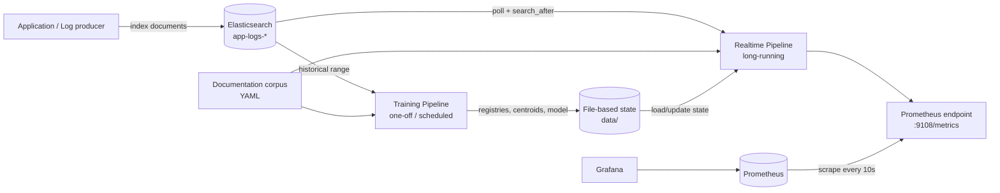
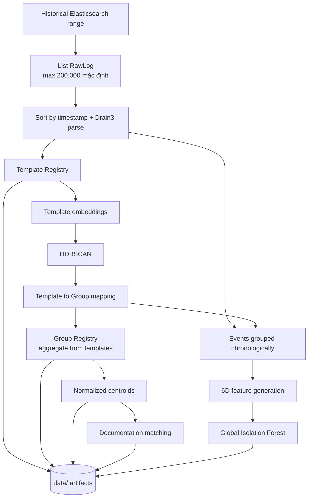
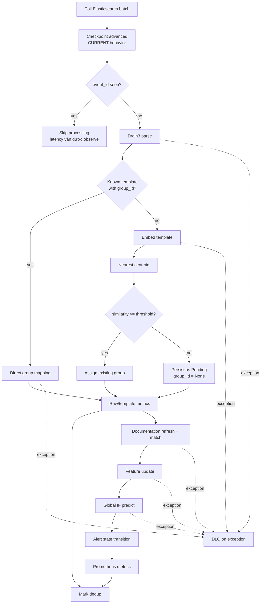
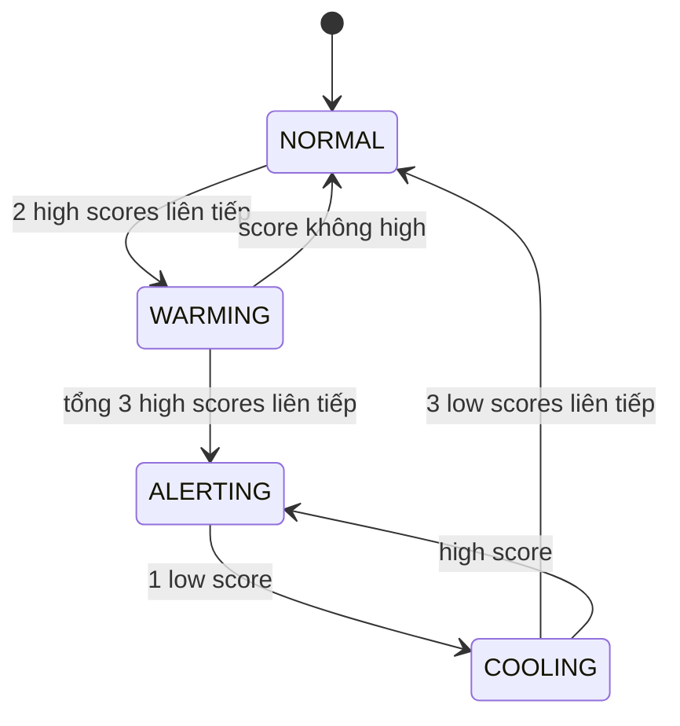

# LogAI Engine Architecture

Tài liệu này mô tả kiến trúc **đang được triển khai trong code** tại ngày
2026-09-08. Khi tài liệu và code khác nhau, code là nguồn xác nhận behavior
thực tế; sai lệch phải được cập nhật lại tại đây và trong
`KNOWN_ISSUES.md`/`ISSUES_FIXED.md`.

## 1. Mục tiêu và phạm vi

LogAI Engine đọc application logs từ Elasticsearch, chuẩn hóa message thành
template, gom các template tương tự thành semantic group, đối chiếu group với
documentation corpus, phát hiện bất thường theo lưu lượng log và xuất kết quả
qua Prometheus.

Hệ thống gồm hai workflow độc lập nhưng dùng chung artifacts:

- **Training**: batch/offline, tạo template registry, group registry,
  centroids, documentation matches và Global Isolation Forest.
- **Realtime**: long-running, poll log mới, dùng artifacts đã train để assign,
  predict và xuất metrics. Realtime không chạy HDBSCAN và không retrain model.

Ngoài phạm vi hiện tại:

- Thu thập log trực tiếp từ file, Kafka hoặc agent khác Elasticsearch.
- Giao diện truy vấn REST/GraphQL cho kết quả phân tích.
- Tự động gửi notification; hệ thống chỉ xuất alert state qua metrics.
- Multi-instance active-active trên cùng state directory.
- Quản lý vòng đời/replay DLQ tự động.

## 2. System context



Trong Docker Compose, Elasticsearch, LogAI Engine, Prometheus và Grafana chạy
thành bốn services. Volume `logai-data` giữ artifacts qua restart container.

## 3. Nguồn cấu hình và thứ tự ưu tiên

`logai/config.py` định nghĩa các dataclass cấu hình. Giá trị được resolve theo
thứ tự sau, lớp sau ghi đè lớp trước:

1. Default trong dataclass.
2. File YAML, mặc định là `config.yaml`.
3. Environment variables được hỗ trợ trực tiếp.

Environment overrides hiện có:

| Variable | Đích |
|---|---|
| `LOGAI_ES_HOSTS` | `elasticsearch.hosts`, phân tách bằng dấu phẩy |
| `LOGAI_ES_USER` | `elasticsearch.username` |
| `LOGAI_ES_PASSWORD` | `elasticsearch.password` |
| `LOGAI_METRICS_PORT` | `metrics.http_port` |

Các cấu hình khác chỉ thay đổi qua YAML hoặc code. `ReliabilityConfig` có các
giá trị retry, nhưng decorator của Elasticsearch collector hiện dùng trực tiếp
default của `retry_with_backoff`; các giá trị `reliability.max_retries` và
`backoff_*` chưa được truyền vào collector.

## 4. External input contract

### 4.1 Elasticsearch document

Log producer ghi document vào index khớp `elasticsearch.index`, mặc định
`app-logs-*`.

```json
{
  "@timestamp": "2026-09-07T10:00:01Z",
  "service": "payment",
  "level": "ERROR",
  "message": "DB connection timeout host=10.0.0.1",
  "trace_id": "7dcfe15c",
  "host": "payment-01"
}
```

| Field | Kiểu được code chấp nhận | Bắt buộc thực tế | Default/behavior |
|---|---|---:|---|
| `@timestamp` | ISO8601 string hoặc number | Nên có | Thiếu/không parse được thì dùng thời gian xử lý hiện tại |
| `service` | string | Không | `"unknown"` |
| `level` | string | Không | `"INFO"` |
| `message` | string | Không | `""` |
| field khác | JSON-compatible | Không | Được giữ trong `RawLog.metadata` |

Quy ước quan trọng:

- ISO8601 có hậu tố `Z` được đổi thành `+00:00` rồi parse.
- Number hiện được hiểu trực tiếp là **epoch seconds**. Epoch milliseconds
  chưa được normalize và không nên gửi ở trạng thái code hiện tại.
- `event_id` nội bộ lấy từ Elasticsearch `_id`, không lấy từ payload.
- Collector hiện gán `es_index` bằng index pattern cấu hình, không phải
  `_index` thật của hit.
- Dedup chỉ dùng `_id`; hai document ở hai index khác nhau nhưng trùng `_id`
  có thể bị xem là cùng event.
- Query realtime sort theo `@timestamp` tăng dần rồi `_id` tăng dần. Index phải
  có mapping tương thích với sort này.

### 4.2 Documentation corpus

`docs/documentation_corpus.yaml` là input của Documentation Matcher.

```yaml
- id: DOC-DB-001
  title: Database connection timeout
  text: Database connection timeout while connecting to the primary database.
  error_code: ERR_DB_TIMEOUT
```

| Field | Kiểu | Bắt buộc | Vai trò |
|---|---|---:|---|
| `id` | string/coercible to string | Có | Stable documentation identifier |
| `title` | string | Không | Metadata hiển thị; default rỗng |
| `text` | string | Có | Nội dung dùng để tạo embedding |
| `error_code` | string | Không | Ghi vào `GroupState` khi match thành công |

Corpus hiện là dữ liệu demo và phải được thay bằng runbook/knowledge base thật
trước production.

## 5. Core data contracts

Các schema dưới đây là dataclass trong `logai/models.py`.

### 5.1 RawLog

Output chuẩn hóa của collector và input của parser.

| Field | Kiểu | Ý nghĩa |
|---|---|---|
| `timestamp` | `float` | Epoch seconds UTC |
| `service` | `str` | Tên service sinh log |
| `level` | `str` | Log level |
| `message` | `str` | Raw message |
| `metadata` | `Dict[str, Any]` | Các field Elasticsearch còn lại |
| `event_id` | `str` | Elasticsearch `_id` |
| `es_index` | `Optional[str]` | Hiện là configured index pattern |
| `es_doc_id` | `Optional[str]` | Elasticsearch `_id` |

### 5.2 ParsedEvent

Output của Drain3 parser.

| Field | Kiểu | Ý nghĩa |
|---|---|---|
| `raw` | `RawLog` | Event gốc |
| `template_id` | `str` | `T` + Drain3 cluster ID, zero-padded 5 chữ số |
| `template` | `str` | Message template chứa wildcard `<*>` |
| `parameters` | `List[str]` | Giá trị wildcard trích xuất best-effort |
| `is_new_template` | `bool` | `true` khi Drain3 tạo cluster mới |

Parameter extraction chỉ hoạt động khi số token của template và message bằng
nhau. Nếu không, `parameters` là list rỗng.

### 5.3 TemplateState

Metadata persisted theo `template_id`.

| Field | Kiểu | Default | Ý nghĩa |
|---|---|---|---|
| `template_id` | `str` | bắt buộc | Registry key |
| `template_text` | `str` | bắt buộc | Template mới nhất |
| `service` | `str` | bắt buộc | Service gắn với template |
| `module` | `str` | `""` | Chưa được pipeline populate |
| `first_seen` | `float` | current time | Event sớm nhất |
| `last_seen` | `float` | current time | Event gần nhất |
| `event_count` | `int` | `0` | Tổng event đã ghi nhận |
| `group_id` | `Optional[str]` | `None` | Semantic group hoặc pending |

### 5.4 GroupState

Metadata persisted theo `group_id`.

| Field | Kiểu | Default | Ý nghĩa |
|---|---|---|---|
| `group_id` | `str` | bắt buộc | Registry key |
| `service` | `str` | `""` | Service của representative template |
| `module` | `str` | `""` | Chưa được pipeline populate |
| `template_ids` | `List[str]` | `[]` | Templates thuộc group |
| `representative_template` | `str` | `""` | Template đại diện |
| `error_code` | `str` | `""` | Error code từ documentation match |
| `documented` | `bool` | `false` | Có vượt doc similarity threshold |
| `documentation_id` | `Optional[str]` | `None` | ID tài liệu match tốt nhất |
| `confidence` | `float` | `0.0` | Cosine similarity với documentation |
| `severity` | `str` | `"unknown"` | Chưa được pipeline populate |
| `first_seen` | `float` | current time | Mốc sớm nhất của group |
| `last_seen` | `float` | current time | Mốc gần nhất của group |
| `event_count` | `int` | `0` | Tổng event của group |
| `active` | `bool` | `true` | Chưa có lifecycle tự động thay đổi |

Training aggregate `event_count`, `first_seen`, `last_seen` từ
`TemplateRegistry`, có độ phức tạp O(T) theo số template thay vì O(N) theo số
event. Với group chứa nhiều service, service của template đầu tiên được chọn.

### 5.5 GroupedEvent

| Field | Kiểu | Ý nghĩa |
|---|---|---|
| `parsed` | `ParsedEvent` | Event đã parse |
| `group_id` | `str` | Group được assign |
| `group_similarity` | `float` | `1.0` với known template, cosine similarity với template mới |

### 5.6 FeatureVector

Vector tám chiều, không chứa volume tuyệt đối và không dùng normalizer riêng.
Bảo đảm cách ly baseline (tính baseline từ lịch sử trước khi append sample mới)
và áp dụng numerical clipping guards.

| Field | Công thức/ý nghĩa | Clipping |
|---|---|---|
| `z_score_10s` | `(rate_10s - mu10) / (sigma10 + eps)`; độ lệch chuẩn hóa 10s | `[-10, 10]` |
| `z_score_1m` | `(rate_1m - mu1m) / (sigma1m + eps)`; độ lệch chuẩn hóa 1m | `[-10, 10]` |
| `short_growth_rate` | `rate_10s / (rate_1m + eps)`; tỷ lệ tăng trưởng tức thì 10s vs 1m | `[0, 6]` |
| `growth_rate` | `rate_1m / (rate_5m + eps)`; tỷ lệ tăng trưởng 1m vs 5m | `[0, 5]` |
| `burstiness_10s` | `sigma10^2 / (mu10^2 + eps)`; hệ số biến thiên bậc hai (CV^2) trên 10s | `[0, 20]` |
| `rate_delta_norm` | `(rate_1m - rate_5m) / (sigma1m + eps)` | `[-10, 10]` |
| `slope_norm` | Linear slope của rate 1m history chia mu1m | `[-10, 10]` |
| `spike_ratio_10s` | Max recent 10s rate chia mu10 | `[0, 20]` |

`FeatureVector.as_vector()` luôn trả feature theo đúng thứ tự trên. Event đầu
của group tạo neutral baseline `[0, 0, 1, 1, 0, 0, 0, 1]`.

### 5.7 AnomalyResult và AnomalyState

`AnomalyResult` là output stateless của model:

| Field | Kiểu | Ý nghĩa |
|---|---|---|
| `group_id` | `str` | Group được predict |
| `timestamp` | `float` | Timestamp của feature vector |
| `anomaly_score` | `float` | Score clamp trong `[0, 1]` |
| `anomaly` | `bool` | IF outlier hoặc score vượt threshold |
| `model_version` | `str` | Hiện là `if-global-v2` |

`AnomalyState` bổ sung `consecutive_anomaly_count` và `alert_state` để persist
hysteresis theo group. Alert states gồm `NORMAL`, `WARMING`, `ALERTING`,
`COOLING`.

`WindowState` cũng được khai báo trong models nhưng hiện không được pipeline sử
dụng hoặc persist.

## 6. Training pipeline

Entry point: `scripts/run_training.py`.



### 6.1 Trình tự xử lý

| Bước | Module | Input | Output/state |
|---:|---|---|---|
| 1 | `ElasticsearchCollector.fetch_historical_range` | `start_ts`, `end_ts`, `max_docs` | `List[RawLog]` |
| 2 | `Drain3Parser` | Raw logs sorted theo timestamp | `List[ParsedEvent]`, Drain3 state |
| 3 | `TrainingPipeline._build_template_registry` | Parsed events | Template metadata |
| 4 | `TemplateEmbedder` | Template texts | L2-normalized vectors |
| 5 | `GroupClusterer.cluster` | Template IDs + embedding matrix | HDBSCAN labels |
| 6 | `TrainingPipeline._cluster_templates` | Labels | `template_id -> group_id` |
| 7 | `TrainingPipeline._build_group_registry` | Mapping + Template Registry | Group metadata |
| 8 | `GroupClusterer.compute_centroid` | Embeddings trong group | L2-normalized centroid |
| 9 | `DocumentationMatcher.match_all` | Group centroids | Match metadata trong Group Registry |
| 10 | `FeatureEngine` | Events theo từng group, chronological | `FeatureVector` list |
| 11 | `GlobalAnomalyModel.train` | Tất cả feature vectors | `models/global.pkl` |

### 6.2 Group ID rules

- HDBSCAN cluster label `n` trở thành `Gnnnn`, ví dụ `G0002`.
- Noise label `-1` tạo singleton group `G_SINGLE_nnnn`.
- Group IDs phụ thuộc kết quả clustering và thứ tự template, nên không được bảo
  đảm ổn định qua các lần retraining.
- Template ID ổn định qua restart phụ thuộc việc giữ nguyên
  `drain3_state.bin`.

### 6.3 Điều kiện tạo model

Global model chỉ được fit khi tổng số feature vectors không nhỏ hơn
`anomaly.min_training_samples`, mặc định 30. Nếu không đủ mẫu, training vẫn ghi
registries nhưng không tạo model mới; realtime sẽ bỏ qua anomaly prediction nếu
không tìm thấy `models/global.pkl`.

## 7. Realtime pipeline

Entry point: `scripts/run_realtime.py`.



### 7.1 Known template path

Nếu `TemplateRegistry` đã có template và `group_id`:

1. Không tạo embedding mới.
2. Cập nhật template `last_seen`, `event_count`.
3. Cập nhật group `last_seen`, `event_count`.
4. Chạy documentation match, feature generation, prediction và alert.

`group_similarity` được đặt là `1.0` để biểu thị direct mapping, không phải
cosine similarity được tính lại.

### 7.2 Unknown/pending template path

Nếu template mới hoặc chưa có `group_id`:

1. Tạo embedding cho template.
2. So cosine similarity với tất cả group centroids.
3. Nếu best score đạt `assignment_similarity_threshold`, gắn template vào
   group gần nhất.
4. Nếu không đạt, lưu template với `group_id = None` và chờ training tiếp theo.

Pending event vẫn được tính raw/template metrics và được mark processed, nhưng
không có feature vector, anomaly score hoặc alert state.

### 7.3 Documentation refresh

Corpus được reload khi khoảng thời gian từ lần refresh gần nhất vượt
`doc_matcher.refresh_interval_seconds`, mặc định 300 giây. Reload hiện embed lại
toàn bộ corpus và ghi `doc_embeddings.pkl`; persisted cache chưa được đọc để
tránh recompute.

### 7.4 Anomaly và alert

Isolation Forest trả `decision_function` với giá trị cao hơn là bình thường.
Engine chuyển thành:

```text
anomaly_score = clamp(0.5 - decision_function, 0, 1)
```

`AnomalyResult.anomaly` là true nếu IF predict `-1` hoặc score đạt
`score_alert_threshold`. Alert state machine dùng trực tiếp `score_high` và
`score_low`, không dùng boolean `anomaly` để transition.

Với default config:



Score nằm giữa `score_low` và `score_high` reset countdown tương ứng nhưng không
luôn thay đổi state.

## 8. Module ownership và boundary mapping

| Module | Trách nhiệm | Input | Output | State sở hữu |
|---|---|---|---|---|
| `logai/config.py` | Load và merge cấu hình | YAML + environment | `AppConfig` | Không |
| `logai/models.py` | Data contracts dùng chung | Field values | Dataclass instances | Không |
| `collector/es_collector.py` | Poll realtime và fetch historical | ES config + checkpoint | `RawLog` batches | Search cursor qua CheckpointStore |
| `parsing/drain3_parser.py` | Mine template và extract parameters | `RawLog` | `ParsedEvent` | `drain3_state.bin` |
| `embedding/embedder.py` | Encode text thành normalized vector | Template/doc text | NumPy matrix/vector | Model in-memory/Hugging Face cache |
| `clustering/hdbscan_cluster.py` | Offline clustering, centroid, realtime nearest-group | IDs + vectors | Labels, centroid, assignment | Không |
| `docmatch/doc_matcher.py` | Load corpus và cosine match | YAML + centroids | `MatchResult` | Corpus/embeddings in-memory + cache file |
| `features/feature_engine.py` | Sliding-window aggregation | `group_id`, timestamp | `FeatureVector` | Per-group windows in-memory |
| `anomaly/isolation_forest_model.py` | Train/load/predict global IF | Feature vectors | `AnomalyResult` | `models/global.pkl` + in-memory model |
| `alert/alert_state_machine.py` | Hysteresis theo group | `AnomalyResult` | `AnomalyState` | `anomaly_state.json` |
| `metrics/prometheus_exporter.py` | Expose/update metrics | Parsed/group/anomaly state | `/metrics` | Prometheus client in-memory |
| `storage/base.py` | Atomic JSON/pickle/model persistence | Python objects | Files | File contents |
| `storage/registries.py` | Template/group metadata và vectors | State dataclasses/vectors | Registry lookup/list | Registry files + caches |
| `storage/checkpoint.py` | Persist Elasticsearch cursor | sort values/timestamp | Current checkpoint | `checkpoint.json` |
| `storage/dedup.py` | Event idempotency theo TTL | `event_id` | seen/not seen | `dedup_index.json` |
| `reliability/retry.py` | Exponential backoff + jitter | Callable | Result hoặc re-raised error | Không |
| `reliability/dlq.py` | Ghi và đọc failed events | Payload + error | JSONL records | `dlq.jsonl` |
| `training/train_pipeline.py` | Orchestrate batch training | Historical `RawLog` list | Training artifacts | Qua registries/model stores |
| `realtime/realtime_pipeline.py` | Orchestrate streaming processing | Realtime batches | Metrics + updated state/DLQ | Qua component stores |

Ownership rule: orchestrator quyết định thứ tự và nhánh xử lý; module chuyên
biệt không được tự gọi ngược orchestrator. `models.py` và `config.py` là shared
contracts, không chứa business workflow.

## 9. External output contracts

### 9.1 Prometheus metrics

Endpoint mặc định: `http://<host>:9108/metrics`.

| Metric | Type | Labels | Update semantics |
|---|---|---|---|
| `app_log_events_total` | Counter | `service` | Tăng sau parse/assign thành công |
| `app_log_errors_total` | Counter | `service`, `error_code` | Tăng với level ERROR/CRITICAL/FATAL; `error_code` hiện là `template_id` |
| `app_log_templates_total` | Gauge | `service` | Số template của service; hiện scan toàn registry mỗi event |
| `log_anomaly_score` | Gauge | `group_id`, `documented` | Score gần nhất của group/label pair |
| `log_alert_state` | Gauge | `group_id`, `state` | State hiện tại bằng 1, ba state còn lại bằng 0 |
| `logai_events_received_total` | Counter | Không | Tăng trước khi xử lý mỗi raw event |
| `logai_events_processed_total` | Counter | Không | Tăng sau khi event được mark dedup |
| `logai_events_failed_total` | Counter | Không | Tăng khi event exception và được gửi DLQ |
| `logai_retry_total` | Counter | Không | Đã khai báo nhưng retry helper chưa cập nhật metric này |
| `logai_processing_latency_seconds` | Histogram | Không | Quan sát thời gian `_process_one`, kể cả failure/dedup return |
| `logai_queue_depth` | Gauge | Không | Kích thước batch trong lúc xử lý, 0 sau batch |

Prometheus scrape mỗi 10 giây theo `prometheus.yml`. Metrics client state nằm
trong memory và reset khi process restart; Prometheus giữ time series đã scrape.

### 9.2 Persistent artifacts

| Artifact | Format | Writer | Reader | Nội dung |
|---|---|---|---|---|
| `data/template_registry.json` | JSON object | Training + realtime | Training + realtime | `template_id -> TemplateState` |
| `data/template_embeddings.pkl` | Pickle | Training + realtime | Training + realtime | `template_id -> numpy vector` |
| `data/group_registry.json` | JSON object | Training + realtime | Training + realtime | `group_id -> GroupState` |
| `data/group_centroids.pkl` | Pickle | Training | Training + realtime | `group_id -> normalized centroid` |
| `data/models/global.pkl` | Pickle | Training | Realtime | Global Isolation Forest |
| `data/doc_embeddings.pkl` | Pickle | Doc matcher | Hiện chưa được reuse khi reload | Corpus entries + embeddings |
| `data/drain3_state.bin` | Drain3 persistence | Parser | Parser | Drain tree/template clusters |
| `data/checkpoint.json` | JSON object | Collector | Collector | `search_after`, `last_timestamp` |
| `data/anomaly_state.json` | JSON object | Alert state machine | Alert state machine | `group_id -> AnomalyState` |
| `data/dedup_index.json` | JSON object | Dedup index | Dedup index | `event_id -> processed wall-clock time` |
| `data/dlq.jsonl` | Append-only JSONL | Realtime | Manual replay API | Failed event records |
| `data/window_state.json` | Chưa dùng | Không | Không | Config placeholder |

Pickle files chỉ được load từ nguồn tin cậy. Pickle không phải format an toàn
cho artifact do bên không tin cậy cung cấp.

### 9.3 DLQ record

```json
{
  "failed_at": 1788858000.0,
  "error": "exception message",
  "payload": {
    "timestamp": 1788857999.0,
    "service": "payment",
    "level": "ERROR",
    "message": "...",
    "metadata": {},
    "event_id": "es-document-id",
    "es_index": "app-logs-*",
    "es_doc_id": "es-document-id"
  }
}
```

`DeadLetterQueue.replay()` chỉ yield records và không xóa. `clear()` xóa toàn
bộ file; hiện không có CLI replay/clear chính thức.

## 10. Reliability semantics

### 10.1 Retry

Chỉ Elasticsearch `_search()` được bọc retry ở trạng thái hiện tại.

- Tổng cộng tối đa 1 lần gọi đầu + 5 retry.
- Backoff mặc định: 1, 2, 4, 8, 16 giây, cap 60 giây.
- Mỗi delay có random jitter từ 0% đến 10%.
- Sau khi hết retry, exception được raise ra ngoài.
- Parse, embedding, registry write, feature, model và metrics update không có
  retry riêng; lỗi của các bước này đi thẳng vào per-event exception handler.
- Elasticsearch exception sau khi hết retry xảy ra ngoài `_process_one`, nên
  không được ghi vào event DLQ và có thể làm dừng realtime loop. Docker Compose
  sẽ restart process vì policy `unless-stopped`.

### 10.2 Dedup

Realtime kiểm tra `DedupIndex.seen(event_id)` trước parse. Event thành công được
`mark()` sau toàn bộ processing.

`DedupIndex` sử dụng Bounded LRU Cache (`OrderedDict`) với dung lượng cố định
`reliability.dedup_max_size` (mặc định 200.000 entries).

- Lookup là $O(1)$, insert và eviction tự động loại bỏ phần tử cũ nhất ở đầu ở $O(1)$ amortized (`popitem(last=False)`).
- RAM tiêu thụ cố định ở mức ~20 MB (thay vì tăng không giới hạn theo log volume).
- Hàm `gc()` không còn duyệt $O(D)$, loại bỏ hoàn toàn hiện tượng pipeline stall.
- Snapshot được ghi compact JSON không indent xuống đĩa khi batch có thay đổi (`_dirty`) để phục hồi khi crash.
- Tương thích ngược với file JSON cũ định dạng dict.


### 10.3 Checkpoint và crash recovery

Checkpoint gồm sort value cuối cùng và timestamp cuối cùng. Mỗi setter atomic
write JSON qua temp file + `os.replace`.

**Behavior hiện tại chưa cung cấp at-least-once delivery.** Collector advance
checkpoint ngay sau khi fetch batch và trước khi caller xử lý:

```text
fetch [F, G, H, I, J]
persist checkpoint after J
process F, G, H
process crash
restart from after J -> I và J không được đọc lại
```

Đây là known critical issue. Dedup không thể phục hồi event đã bị checkpoint
bỏ qua. Cho đến khi issue được sửa, tuyên bố “restart không mất dữ liệu” không
phải là guarantee của implementation.

Target semantics sau khi sửa phải là:

1. Fetch batch nhưng chưa advance checkpoint.
2. Xử lý từng event; success được dedup mark, failure được ghi DLQ theo policy.
3. Flush state cần thiết.
4. Chỉ commit checkpoint khi batch đạt điều kiện hoàn tất.
5. Restart có thể refetch batch; dedup loại events đã commit thành công.

### 10.4 File atomicity và process model

`JSONStore`, `PickleStore` và `ModelStore` ghi temp file rồi `os.replace`, giúp
tránh file nửa chừng khi process crash. Lock là `threading.RLock`, chỉ bảo vệ
threads trong cùng process.

Không có file lock/distributed lock. Hai OS processes cùng ghi một artifact có
thể overwrite state của nhau. Chỉ một realtime writer được phép dùng cùng
`data/` directory.

DLQ là append JSONL dưới thread lock nhưng không dùng temp+replace hoặc `fsync`;
record cuối có thể không bền vững nếu host mất điện đúng lúc ghi.

### 10.5 State durability theo component

| State | Durability hiện tại |
|---|---|
| Checkpoint | Flush ngay từng setter |
| Alert state | Flush mỗi transition |
| Dedup | Flush cuối batch qua `gc()` |
| Template/group metadata trong realtime | Nhiều update dùng `flush=False`; không có explicit registry flush cuối batch |
| Template embeddings | Save toàn embedding cache khi set |
| Feature windows | Chỉ in-memory; reset khi restart |
| Prometheus client counters/gauges | Chỉ in-memory; reset khi restart |

Feature history reset làm group quay về cold-start/neutral behavior sau restart,
dù `window_state_file` đã có trong config.

## 11. Các lựa chọn thiết kế

### 11.1 Elasticsearch polling thay vì push/queue

`search_after` cho phép collector đơn giản, không cần Kafka và phù hợp MVP.
Đổi lại, throughput phụ thuộc polling/batch size, cursor commit phải được xử lý
cẩn thận và index mapping phải hỗ trợ stable sort.

### 11.2 Drain3 cho template mining

Drain3 là online parser, phù hợp cả training và realtime. Persisted tree giúp
template IDs ổn định khi restart. Nếu mất hoặc thay `drain3_state.bin`, template
IDs có thể thay đổi và làm lệch registries cũ.

### 11.3 Sentence Transformer cho semantic representation

`all-MiniLM-L6-v2` tạo embedding 384 chiều và được L2 normalize. Dot product vì
thế tương đương cosine similarity. Model phải được tải từ Hugging Face ở lần
đầu hoặc pre-cache trong image; đây là dependency runtime lớn.

### 11.4 Offline HDBSCAN, realtime nearest centroid

HDBSCAN chỉ chạy trong training để tránh thay đổi topology liên tục và chi phí
clustering ở realtime. Template mới chỉ được gắn vào group hiện có khi đạt
similarity threshold; template khác biệt được giữ pending đến lần training sau.

### 11.5 Một Global Isolation Forest

Một model chung giảm memory và loại cold-start model theo group. Sáu feature
dimensionless giúp so sánh hành vi giữa service có volume khác nhau. Tradeoff:
phân phối toàn cục có thể che khuất pattern đặc thù của một group, nên threshold
và contamination phải tune bằng dữ liệu thật.

### 11.6 File-based storage

JSON dễ kiểm tra, pickle phù hợp NumPy/sklearn và atomic replace đủ cho một
writer. Lựa chọn này giảm dependency vận hành nhưng không hỗ trợ horizontal
scaling, transaction nhiều file, query hiệu quả hoặc state lớn.

### 11.7 Prometheus pull model

Engine chỉ expose current state/counters; Prometheus chịu trách nhiệm scrape và
lưu time series. Không có API lịch sử riêng trong engine.

## 12. Giới hạn và known issues

Các giới hạn dưới đây là behavior đã quan sát từ code, không phải mục tiêu
thiết kế tương lai:

| Mức độ | Giới hạn | Ảnh hưởng |
|---|---|---|
| Critical | Checkpoint commit trước xử lý batch | Có thể mất event khi crash |
| Resolved | Dedup JSON không bounded, GC/flush O(D) | Đã giải quyết (Bounded LRU Cache - Issue 2) |
| Critical | Historical fetch và parse giữ full lists | Training có thể OOM; fetch mặc định cap 200,000 docs |
| Critical | Feature generation scan timestamps và giữ toàn bộ vectors | CPU/RAM tăng mạnh khi training lớn |
| High | Template metric scan toàn registry mỗi event | Realtime CPU/object allocation tăng theo số template |
| High | Feature windows không persist | Restart mất baseline ngắn hạn |
| High | Realtime registry metadata không flush cuối batch | Có thể mất cập nhật metadata khi crash |
| Resolved | `rolling_window_points` config chưa được dùng | Đã giải quyết (kết nối trực tiếp vào _GroupWindow - Issue 7) |
| Medium | `logai_retry_total` không được nối với retry helper | Metric luôn không phản ánh retry thật |
| Medium | Documentation cache chỉ ghi, chưa đọc reuse | Reload embed lại corpus |
| Medium | Re-run training trên registry cũ có thể cộng lại event counts | Overlapping lookback làm metadata count tăng lặp |
| Medium | Group IDs không ổn định qua retraining | Dashboard/history theo `group_id` có thể đứt chuỗi |
| Operational | Single writer, không có inter-process lock | Không chạy nhiều instance trên cùng volume |
| Operational | Docker ES tắt security; Grafana dùng password mặc định | Chỉ phù hợp local/demo |

Nguồn theo dõi remediation là `KNOWN_ISSUES.md`; lịch sử giải quyết được ghi ở
`ISSUES_FIXED.md`.

## 13. Runtime và deployment invariants

Để hệ thống hoạt động đúng theo kiến trúc hiện tại:

1. Chạy training trước realtime lần đầu để tạo registries, centroids và global
   model.
2. Training và realtime phải dùng cùng `data/` volume và cùng Drain3 state.
3. Chỉ một realtime process được ghi vào một state directory.
4. Elasticsearch documents phải có sortable `@timestamp` và stable unique ID.
5. Documentation corpus và model embedding phải có cùng embedding dimension.
6. Không thay model embedding mà giữ centroids/doc embeddings cũ; phải retrain
   artifacts cùng nhau.
7. Pickle artifacts chỉ được tạo và load trong trusted environment, với phiên
   bản dependency tương thích.

## 14. Quy tắc thay đổi kiến trúc

Một thay đổi phải cập nhật tài liệu này khi tác động một trong các phần sau:

- External input fields, defaults hoặc timestamp semantics.
- Data contract trong `models.py`.
- Thứ tự/nhánh của training hoặc realtime pipeline.
- Artifact filename, format, ownership hoặc durability.
- Metric name, type, label hoặc update semantics.
- Retry, checkpoint, dedup, DLQ hoặc crash recovery guarantee.
- Model/feature dimension, group identity hoặc documentation matching.
- Process topology, concurrency hoặc deployment assumptions.

Các optimization không đổi contract vẫn phải được ghi vào `ISSUES_FIXED.md` và
đánh dấu trạng thái tương ứng trong `KNOWN_ISSUES.md`.
