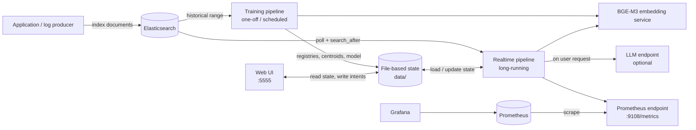
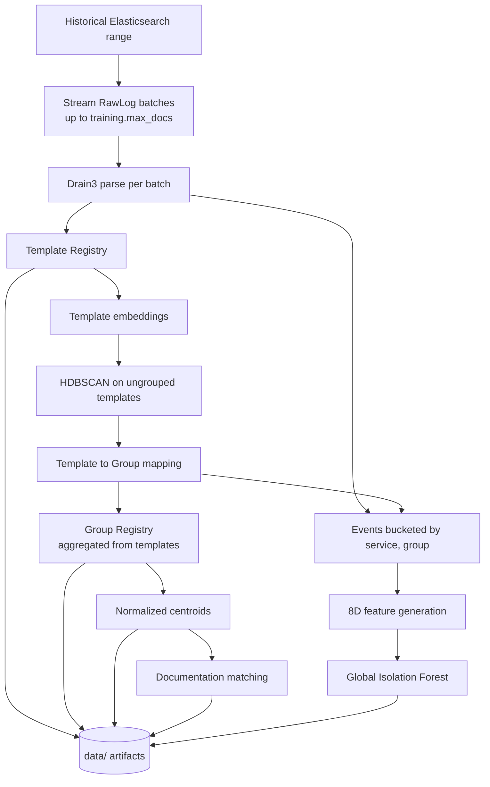
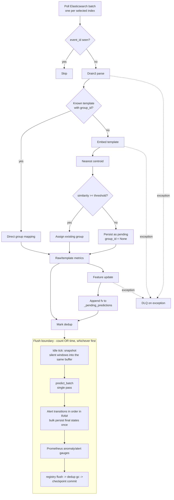
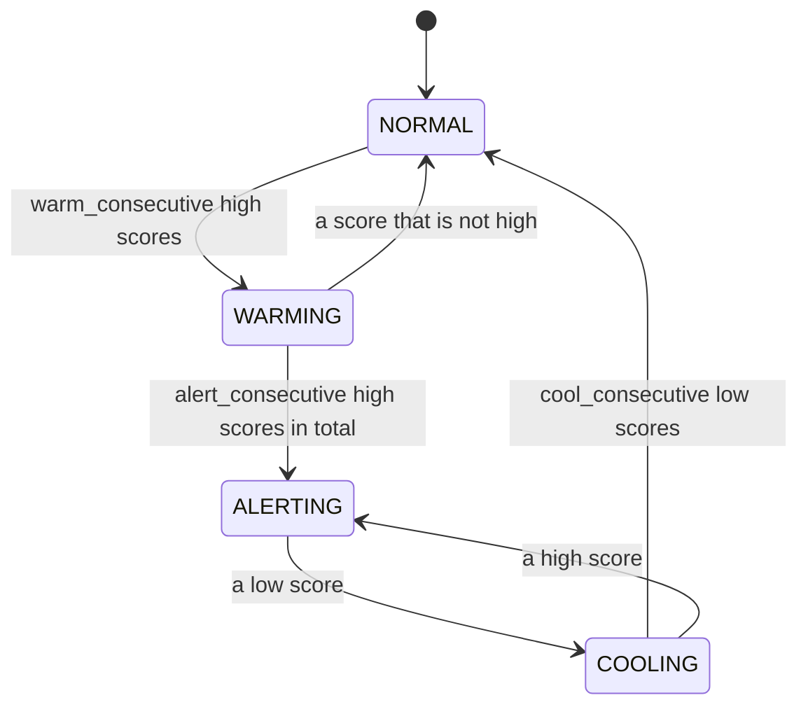

# LogAI Engine Architecture

This document describes the architecture **as implemented in the code**. When
the document and the code disagree, the code (and its tests) is the source of
truth, and this document must be corrected.

Related docs: [`README.md`](README.md) (run/deploy),
[`docs/WEB_UI.md`](docs/WEB_UI.md) (Web UI behavior and the full HTTP API),
[`k8s/README.md`](k8s/README.md) (Kubernetes).

## 1. Purpose and scope

LogAI Engine reads application logs from Elasticsearch, normalizes each message
into a template, clusters similar templates into semantic groups, matches
groups against a documentation corpus, detects anomalies in log rates, and
exports the results through Prometheus and a web UI.

Two independent workflows share the same artifacts:

- **Training**: batch/offline. Builds the template registry, group registry,
  centroids, documentation matches and the global Isolation Forest.
- **Realtime**: long-running. Polls new logs, uses the trained artifacts to
  assign, predict and export metrics. Realtime never runs HDBSCAN and never
  retrains the model (except a scheduled retrain, §6.4, which runs training
  in-process and restarts).

Out of scope:

- Collecting logs from files, Kafka or agents other than Elasticsearch.
- Sending notifications; alert state is only exported (metrics + web UI).
- Multiple active instances sharing one state directory.
- Automatic DLQ replay.

## 2. System context



Docker Compose runs only the LogAI containers (`logai-engine`, `logai-web`, the
one-off `logai-training`, optional Grafana). Elasticsearch and Prometheus are
expected to exist already on the external `aiops-net` network. The named
volume `logai-data` holds all artifacts across container restarts.

The web process and the engine never call each other: they communicate only
through files in `data/`. The web writes *intent* files (documentation,
grouping overrides, index selection, retrain schedule, analysis requests, LLM
profiles); the engine writes *status/result* files.

## 3. Configuration

`logai/config.py` defines the configuration dataclasses. Values resolve in this
order, later layers overriding earlier ones:

1. Dataclass defaults (every setting and its meaning is documented there).
2. YAML file, `config.yaml` by default. It only lists values that differ from
   the defaults; any dataclass field can be added.
3. Environment variables (`LOGAI_ES_*`, `LOGAI_METRICS_*`,
   `LOGAI_STORAGE_BASE_DIR`, `LOGAI_DOCUMENTATION_CORPUS_PATH`,
   `LOGAI_EMBEDDING_*`, `LOGAI_LLM_*`). The full list with comments is in
   [`.env.example`](.env.example); the web process additionally reads
   `LOGAI_WEB_HOST`, `LOGAI_WEB_PORT`, `LOGAI_WEB_DATA_DIR`.

`LOGAI_STORAGE_BASE_DIR` moves the storage base, the model directory, the
Drain3 state and the three documentation runtime files together.

The CLI of `scripts/run_training.py` only overrides `lookback_seconds`
(`--lookback-hours`); `batch_size` and `max_docs` come from config, or from the
retrain schedule when training runs in-process (§6.4).

## 4. External input contract

### 4.1 Elasticsearch document

```json
{
  "@timestamp": "2026-09-07T10:00:01Z",
  "service": "payment",
  "level": "ERROR",
  "message": "DB connection timeout host=10.0.0.1",
  "trace_id": "7dcfe15c",
  "host": "payment-01"
}
```

| Field | Accepted type | Required in practice | Default / behavior |
|---|---|---:|---|
| `@timestamp` | ISO8601 string or number | Should exist | Missing/unparseable → processing time |
| `service` (or `service.name`, then `service_code2`) | string | No | `"unknown"` |
| `level` (or `log.level`, then the 3rd token of the message) | string | No | `"INFO"` |
| `message` | string | No | `""` |
| other fields | JSON-compatible | No | Kept in `RawLog.metadata` (noise keys such as `ecs`, `agent`, `host`, `log` are dropped) |

Rules:

- ISO8601 with a `Z` suffix is parsed as `+00:00`.
- A number is read as **epoch seconds**; epoch milliseconds are not normalized.
- `event_id` comes from the Elasticsearch `_id`, not from the payload, and
  `es_index` is the hit's real `_index`.
- Dedup uses `_id` only: two documents in different indices with the same
  `_id` are treated as the same event.
- Realtime queries sort by `@timestamp` asc, then `_doc` asc; the index mapping
  must support that sort.

### 4.2 Index selection (Data sources page)

The user picks indices or patterns (`app-logs-*`) on the **Data sources** page.

- The web writes `data/es_index_selection.json` (`entries: [{pattern, added_at}]`).
- The engine checks the file's mtime on every poll (~1 s). It resolves patterns
  to concrete indices (`indices.get(expand_wildcards=open)`) when the file
  changes or every `elasticsearch.index_refresh_seconds`. It then polls **one
  batch per concrete index**, each with its own cursor. No restart needed.
- **No backfill**: an index first seen under an entry starts at
  `@timestamp >= added_at` of that entry. An index created later under an
  existing pattern (e.g. a daily index) is read from its first document.
- Removing an index drops its cursor; selecting it again starts from that moment.
- Before the first save on the web, the engine keeps the legacy behavior: it
  reads `elasticsearch.index` (`LOGAI_ES_INDEX`) with a single cursor. When the
  selection takes over, new indices start no later than the legacy cursor's
  `last_timestamp`; the overlap is removed by `_id` dedup.
- A failing index (e.g. deleted) does not block the others; the poll loop backs
  off only when every index fails.
- Training uses the same selection (patterns joined by commas) when the file
  exists.
- The engine writes `data/es_index_status.json`: available indices
  (`_cat/indices`, refreshed every 30 s), pattern → indices, per-index progress
  and the applied `selection_revision`. The web has no ES credentials and only
  reads this file.

### 4.3 Documentation corpus

`docs/documentation_corpus.yaml` is a seed used only on first start. The
runtime source of truth is `data/documentation_corpus.json`, edited in the web
UI. `data/documentation_overrides.json` stores manual document choices per
group; a manual choice wins over the automatic cosine match until it is
cleared. The engine checks revisions every `doc_matcher.refresh_interval_seconds`
(5 s) and updates the group registry without restarting or retraining.

```yaml
- id: DOC-DB-001
  title: Database connection timeout
  text: Database connection timeout while connecting to the primary database.
  error_code: ERR_DB_TIMEOUT
```

| Field | Type | Required | Role |
|---|---|---:|---|
| `id` | string | Yes | Stable document identifier |
| `title` | string | No | Display metadata |
| `text` | string | Yes | Text that is embedded for matching |
| `error_code` | string | No | Copied to `GroupState` on a match |

- Documents created through the API get sequential IDs (`DOC-001`, ...). A
  monotonic counter guarantees deleted IDs are never reused; seed IDs are kept.
- Web mutations use optimistic revisions: two browsers editing the same snapshot
  get HTTP 409 instead of overwriting each other.
- A document used by any active group (manual or automatic) cannot be deleted
  until that assignment changes.
- Overrides store a fingerprint of the group's membership for audit; a manual
  assignment stays attached to the group ID when membership changes.
- Documentation mutations are blocked while a grouping revision is pending, so
  nothing is written from a stale snapshot.

The shipped corpus is demo data and must be replaced by a real runbook /
knowledge base before production.

## 5. Core data contracts

Dataclasses in `logai/models.py`.

### 5.1 RawLog

Normalized collector output; parser input.

| Field | Type | Meaning |
|---|---|---|
| `timestamp` | `float` | Epoch seconds UTC |
| `service` | `str` | Service that produced the log |
| `level` | `str` | Log level |
| `message` | `str` | Raw message |
| `metadata` | `Dict[str, Any]` | Remaining Elasticsearch fields |
| `event_id` | `str` | Elasticsearch `_id` |
| `es_index` | `Optional[str]` | Elasticsearch `_index` |
| `es_doc_id` | `Optional[str]` | Elasticsearch `_id` |

### 5.2 ParsedEvent

Drain3 parser output.

| Field | Type | Meaning |
|---|---|---|
| `raw` | `RawLog` | Original event |
| `template_id` | `str` | `T` + Drain3 cluster ID, zero-padded to 5 digits |
| `template` | `str` | Template with `<*>` wildcards |
| `parameters` | `List[str]` | Best-effort wildcard values (empty when token counts differ) |
| `is_new_template` | `bool` | `true` when Drain3 created a new cluster |

### 5.3 TemplateState

Persisted per `template_id` in `template_registry.json`.

| Field | Type | Default | Meaning |
|---|---|---|---|
| `template_id` | `str` | required | Registry key |
| `template_text` | `str` | required | Latest template text |
| `service` | `str` | required | Service of the template |
| `level` | `str` | `"INFO"` | **Most severe level ever seen** (monotonic). Ranked by `LEVEL_RANK`; `WARN`/`WARNING` and `FATAL`/`CRITICAL` rank equal; unknown levels rank as `INFO` |
| `module` | `str` | `""` | Not populated by the pipeline |
| `first_seen` / `last_seen` | `float` | now | Earliest / latest event |
| `event_count` | `int` | `0` | Events recorded |
| `group_id` | `Optional[str]` | `None` | Semantic group, or `None` while pending |

### 5.4 GroupState

Persisted per `group_id` in `group_registry.json`.

| Field | Type | Default | Meaning |
|---|---|---|---|
| `group_id` | `str` | required | Registry key |
| `service` | `str` | `""` | Service of the representative template (first template for multi-service groups) |
| `module` | `str` | `""` | Not populated by the pipeline |
| `template_ids` | `List[str]` | `[]` | Member templates |
| `representative_template` | `str` | `""` | Representative template |
| `error_code` | `str` | `""` | From the documentation match |
| `documented` | `bool` | `false` | Similarity passed the doc threshold |
| `documentation_id` | `Optional[str]` | `None` | Best matching document |
| `confidence` | `float` | `0.0` | Cosine similarity with that document |
| `documentation_source` | `str` | `"automatic"` | `automatic`, `manual`, `stale_override` (document gone) or `none` |
| `severity` | `str` | `"unknown"` | Not populated by the pipeline |
| `first_seen` / `last_seen` | `float` | now | Group time range |
| `event_count` | `int` | `0` | Events in the group |
| `active` | `bool` | `true` | No automatic lifecycle changes it |

Training aggregates `event_count`, `first_seen`, `last_seen` from the template
registry: O(templates), not O(events).

### 5.5 GroupedEvent

| Field | Type | Meaning |
|---|---|---|
| `parsed` | `ParsedEvent` | Parsed event |
| `group_id` | `str` | Assigned group |
| `group_similarity` | `float` | `1.0` for a known template; cosine similarity for a newly assigned one |

### 5.6 FeatureVector

Eight dimensionless features. Absolute volume is not a model dimension:
`count_1m` travels with the vector as metadata to gate alerts but is excluded
from `as_vector()`. Baselines are computed from history *before* appending the
new sample, and ratios have numerical guards.

`FeatureVector.group_id` is a **`Tuple[str, str]` = `(service, group_id)`**:
sliding windows are split per service inside a semantic group so one service's
baseline is not averaged with another's. It is an identity label, not a
feature. In `anomaly_state.json` the tuple is flattened to a JSON-list string
at the `AlertStateMachine` seam (`group_id_key`), because JSON keys cannot be
tuples.

| Field | Formula | Clip |
|---|---|---|
| `z_score_10s` | `(rate_10s - mu10) / (sigma10 + eps)` | `[-10, 10]` |
| `z_score_1m` | `(rate_1m - mu1m) / (sigma1m + eps)` | `[-10, 10]` |
| `short_growth_rate` | `rate_10s / max(rate_1m, rate_floor)` | `[0, 6]` |
| `growth_rate` | `rate_1m / (rate_5m + eps)` | `[0, 5]` |
| `burstiness_10s` | `sigma10^2 / max(mu10, rate_floor)^2` | `[0, 20]` |
| `rate_delta_norm` | `(rate_1m - rate_5m) / (sigma1m + eps)` | `[-10, 10]` |
| `slope_norm` | Linear slope of 1m rate history / mu1m | `[-10, 10]` |
| `spike_ratio_10s` | Max recent 10s rate / `max(mu10, rate_floor)` | `[0, 20]` |

`as_vector()` always returns this order. A window's first event yields the
neutral baseline `[0, 0, 1, 1, 0, 0, 0, 1]`. Baselines are time-based: closed
10 s and 1 m buckets over `features.baseline_seconds`.

### 5.7 AnomalyResult and AnomalyState

`AnomalyResult` is the stateless model output:

| Field | Type | Meaning |
|---|---|---|
| `group_id` | `Tuple[str, str]` | `(service, group_id)` window |
| `timestamp` | `float` | Feature vector timestamp |
| `anomaly_score` | `float` | Score clamped to `[0, 1]` |
| `anomaly` | `bool` | IF outlier or score ≥ `score_alert_threshold` |
| `model_version` | `str` | `if-global-v3` |
| `count_1m` | `int \| None` | Volume metadata, not a model dimension |

`AnomalyState` adds `consecutive_anomaly_count` and `alert_state` to persist
hysteresis per window. States: `NORMAL`, `WARMING`, `ALERTING`, `COOLING`.

A high score may only escalate when `count_1m >= alert.min_events_1m`. Because
windows are per service, this threshold applies to **that service's** events
per minute, not the whole group. Under-volume scores are still exported but
the state machine treats them as recovery signals.

## 6. Training pipeline

Entry point: `scripts/run_training.py` (or in-process retrain, §6.4).



### 6.1 Steps

| Step | Module | Input | Output / state |
|---:|---|---|---|
| 1 | `ElasticsearchCollector.stream_historical_batches` | `start_ts`, `end_ts`, `max_docs`, `batch_size`, cursor | Iterator of `(List[RawLog], cursor)` |
| 2 | `Drain3Parser` | Each batch, in timestamp order | Drain3 state + durable training event index |
| 3 | `TrainingPipeline._rebuild_template_registry` | Event index | Template metadata (incl. max-severity `level`) |
| 4 | `TemplateEmbedder` | New or changed template texts | L2-normalized vectors |
| 5 | `TrainingPipeline._cluster_templates` | Ungrouped templates + embeddings | `template_id -> group_id` (§6.2) |
| 6 | `TrainingPipeline` (Phase 5) | Mapping + grouping overrides | Group registry + centroids |
| 7 | `DocumentationMatcher.match_all`, then `DocumentationRefreshWorker.refresh_once` | Centroids, corpus, manual overrides | Documentation fields in the group registry |
| 8 | `TrainingPipeline._group_events` | Event index + mapping | Timestamps per `(service, group_id)` |
| 9 | `FeatureEngine` per window | Chronological timestamps | `FeatureVector` list |
| 10 | `GlobalAnomalyModel.train` | All feature vectors | `models/global_v3.pkl` |

Events with an `event_id` already in the event index (a resumed run, or a
duplicate across batch boundaries) are skipped before parsing. The Drain3
state is saved once per batch, then the event index, then the cursor (§10.3).

Clustering still groups templates **across services**; only the rate clocks
(features/alerts) are split per service.

The Isolation Forest is only fitted when the number of feature vectors is at
least `anomaly.min_training_samples` (30). Otherwise registries are still
written but no new model is created, and realtime skips prediction while
`models/global_v3.pkl` is missing.

### 6.2 Retrain: templates kept, groups frozen

**Templates.** IDs (`T{cluster_id}`) are stable because `drain3_state.bin` is
kept and shared by training and realtime. Phase 2 **merges** into the existing
registry: a template seen in the training window takes that window's counts
(so overlapping lookbacks do not double-count); older templates are kept with
their embeddings. A template that has a group is **never deleted**; only
ungrouped templates are pruned after `training.template_ttl_days` (30, by event
time) and only when no override references them. Phase 3 embeds only new or
changed template texts.

**Frozen groups.** A template that already belongs to a group stays there;
existing group IDs, members and documentation never change (no merge, split or
delete). Only ungrouped templates (new, or pending from realtime) are placed:

1. into the nearest existing group when cosine similarity with its centroid is
   ≥ `clustering.assignment_similarity_threshold` (same rule as realtime);
2. the rest go through HDBSCAN **among themselves** → new groups `G{n:04d}`
   from a monotonic counter (IDs are never reused); noise becomes one-template
   groups (shown as `singleton` in the web).

Existing centroids are recomputed from their members. `data/group_lineage.json`
records `added` (old group → added templates), `new` (new group → members) and
`next_group_number`; it is written after the registries are published. On
start, realtime drops alert state and LLM analyses of groups no longer in the
registry (only possible after manual web actions).

### 6.3 Manual retrain

Stop the engine → train → start. Realtime resumes from its per-index cursors,
so logs produced meanwhile are not lost (as long as ES retains them). Features
and alerts run on event time, so the backlog is scored as if live; alerts are
delayed by the downtime plus catch-up time. Track catch-up with
`time() - logai_last_processed_event_timestamp_seconds`.

### 6.4 Scheduled retrain (web **Retrain** page)

- The web writes `retrain_schedule.json` (time, weekdays, time zone,
  `lookback_hours`, `max_docs`, or a "retrain now" request).
- The engine's control tick decides when a run is due. A run missed while the
  engine was down is skipped, as with cron.
- At a batch boundary the poll loop:
  1. flushes;
  2. stops the documentation and LLM workers;
  3. runs `run_training_from_elasticsearch` in-process;
  4. writes the result to `retrain_status.json`;
  5. `os.execv`s itself to reload every artifact. It always restarts, even if
     training failed.
- During training a heartbeat in `retrain_status.json` keeps
  `scripts/healthcheck.py` ready.

**Rollback.**
- Just before training, every artifact that training writes is copied to
  `data/retrain_backup/`: template/group registries, embeddings, centroids, doc
  embeddings, grouping status, lineage, Drain3 state, documentation status and
  `models/`.
- `manifest.json` is written last, so a backup without a manifest is
  incomplete.
- If training fails, the backup is restored, the training checkpoint and event
  index are deleted, and the status reads `failed · rolled back`.
- If the engine is killed mid-training (status still `running` at start), it
  restores before loading anything and records `failed`, `interrupted: true`.
- Restore is safe to repeat if it is itself interrupted.

**Missed runs.** On start, the engine takes its last sign of life (heartbeats
in `grouping_status.json` / `retrain_status.json`, or the last schedule save).
Each scheduled time inside the downtime becomes a `missed` entry (at most 20);
missed runs are not executed afterwards. `missed_checked_until` prevents
duplicates.

## 7. Realtime pipeline

Entry point: `scripts/run_realtime.py`.

Inference is **micro-batched**: each event is parsed, grouped and featurized,
then `(window_key, FeatureVector)` is appended to `_pending_predictions`
(`window_key = (service, group_id)`). The whole buffer is scored by **one**
`predict_batch` at the flush boundary (§7.5).



### 7.1 Known template (fast path)

If the template registry already has the template with a `group_id`:

1. No embedding request, no centroid comparison, no template-count update.
2. Update the template's `last_seen`, `event_count`, and promote `level` if this
   event is more severe.
3. Update the group's `last_seen`, `event_count`.
4. Update features and append the vector to the prediction buffer.

`group_similarity` is `1.0` (direct mapping, not a recomputed cosine).

### 7.2 Unknown / pending template

If the template is new or has no `group_id`:

1. Embed it via `embedder.embed_one()`.
2. Compare cosine similarity with every group centroid.
3. If the best score reaches `assignment_similarity_threshold`, assign the
   template to that group.
4. Otherwise store it with `group_id = None` (shown as Unknown) until the next
   training.
5. A brand-new template (`upsert()` returns `is_new=True`) updates the
   `app_log_templates_total{service}` gauge from an O(1) in-memory per-service
   counter; its `level` starts as the event's level.

Pending events still update raw metrics and are marked in dedup, but produce no
feature vector, anomaly score or alert state.

### 7.3 Documentation refresh

`DocumentationRefreshWorker` runs in the background. Every
`doc_matcher.refresh_interval_seconds` (5 s) it compares the corpus/override
revisions with the last applied ones; on change (or for groups invalidated by a
grouping change) it reloads the matcher and rewrites documentation fields of
the affected groups (manual overrides win). Corpus embeddings are cached in
`doc_embeddings.pkl` keyed by the embedding model signature and reused on
start and reload, so only new or changed texts are embedded.

### 7.4 Anomaly and alert

Isolation Forest's `decision_function` is higher for normal points. The engine
converts it to:

```text
anomaly_score = clamp(0.5 - decision_function, 0, 1)
```

`AnomalyResult.anomaly` is true when `decision_function < 0` (exactly IF's
`predict() == -1`) or the score reaches `score_alert_threshold`. The alert state
machine uses `score_high` / `score_low` directly, not the boolean.



Defaults are 2 / 3 / 3 consecutive scores; the shipped `config.yaml` uses
10 / 30 / 10 with `score_high=0.65`, `score_low=0.52`, `min_events_1m=150`. A
score between `score_low` and `score_high` resets the relevant countdown but
does not necessarily change state.

### 7.5 Micro-batch inference

Per-event prediction scores a `(1, 8)` matrix each time and is the main CPU
cost. Instead, vectors are buffered across polls and scored in one pass.

- **`GlobalAnomalyModel.predict_batch(fvs)`**: stacks valid vectors into
  `X = (N, 8)` and calls `decision_function(X)` once. The output has the same
  order and length as the input, with `None` for an untrained model or a wrong
  dimension. `predict()` delegates to `predict_batch([fv])[0]`. A batch of 500
  vectors takes ~4.5 ms.
- **Two flush thresholds, whichever comes first**:
  - the buffer reaches `anomaly.predict_batch_size`, or
  - `anomaly.predict_max_wait_seconds` (1 s) has passed since the first entry.

  The loop sleeps `min(poll_interval, remaining)` so the timer always applies.
- **Idle tick shares the buffer.** Every `alert.idle_eval_seconds`, windows that
  need re-evaluation are `snapshot()`ed into the same buffer:
  - Which windows: `alert_sm.groups_not_normal()` (non-NORMAL, persisted
    across restarts) ∪ `feature_engine.live_window_keys()`.
  - The silence guard is **per window** (`feature_engine.last_event_ts(cell)`):
    a window that is still receiving logs is left to the per-event path, so a
    silent service inside a busy group still cools down.
  - A non-NORMAL window with no in-memory window after a restart snapshots to a
    neutral vector and cools down.
- **Same results as per-event scoring**:
  - One entry per **event**; vectors are not collapsed per group.
  - `transition_batch()` applies transitions in order in RAM and returns every
    intermediate state for metrics.
  - Only each window's final state is `bulk_set()` into `anomaly_state.json`,
    once per flush.
- **Crash safety**: `_flush_batch()` keeps the durability order described in
  §10.3.

### 7.6 On-demand LLM analysis (AI Insights)

The LLM is **never called automatically**; every analysis is requested by a
user from the **AI Insights** page. Three kinds:

| Kind | Target | Result | File (engine writes) |
|---|---|---|---|
| `window` | one `(service, group_id)` window | one of the top-5 candidate documents, or a `suggestion` | `incident_analysis.json` |
| `service` | a whole service | `health`, `summary`, up to 10 `issues` | `service_analysis.json` |
| `template` | an ungrouped template | `verdict` suspicious/benign/unsure + suggested group (top-5 by embedding) or `"new"` | `template_triage.json` |

**Requests and the worker**

- **Requests.** The web writes `analysis_requests.json` (schema v2):
  `{"<kind>:<id>": {"action": "analyze"|"delete", "at": ts, "language": ...}}`.
  - It keeps only the latest action per key and drops entries older than 24 h.
  - `kind="templates_all"` queues up to 50 templates.
  - The endpoints are listed in [`docs/WEB_UI.md`](docs/WEB_UI.md).
- **Engine.** A 2 s control timer, which keeps running while Elasticsearch is
  down, reads the file and submits each request exactly once.
  - Restarts are safe because each record stores `requested_at`.
  - A request that cannot run (missing target, error) gets a `failed` record.
  - A request the engine has not picked up after 10 minutes shows as `failed`
    in the web.
- **Delete.** Only the engine writes result files, so deletes also go through a
  request. A job still running for a deleted record does not write it back.
- **History.** Every finished analysis is also appended to
  `analysis_history.jsonl`, which is append-only and never rewritten. The web
  reads it to show earlier answers for the same target.

**What the LLM is sent**

- **Recent counts only, plus each template's normal level.** The LLM never
  receives cumulative `event_count`. `TemplateActivity` counts events per
  `(service, template)` in two series:
  - 1-minute buckets over 30 minutes → `count_15m`, `count_30m`, `rate_per_min`;
  - 1-hour buckets over 24 hours → `baseline_per_min` = median of the closed
    hours (silent hours count as 0; hours before the engine started are
    unknown; at least 3 hours are needed).

  `ratio` = current rate / max(baseline, 0.1/min). The counts are saved to
  `template_activity.json` every 5 minutes and on stop. Templates silent now but
  active in the last 24 h are still listed with count 0, as a sign that logs
  "disappeared".
- **`window` evidence:**
  - `alert.rate` from `FeatureEngine.describe()`: 10s/1m/5m rates, the median
    and spread of the 1m baseline, and the ratio to the median, with a summary
    sentence. It is read under a lock and does not mutate the window.
  - `alert.at`, the last scored event time.
  - `age_at_alert_minutes` for each template; templates younger than 1 h come
    first.
  - `unknown_templates`: up to 10 ungrouped templates of the same service with
    events in the last 30 minutes, ERROR/WARN first.
- **`service` evidence** also includes `unknown_templates`. Groups are ordered
  by alert state, recent activity, level, then `count_30m`.
- **Hallucination guard.** Only document IDs, group IDs and `similar_case_id`
  values from the candidate lists that were sent are accepted.

**Incidents**

- **Incident history** (`incident_cases.json`; only the web writes it; shown on
  the **Incidents** page). An incident describes what a **whole service** went
  through and was **confirmed by a person**: root cause, resolution, linked
  runbook, time, related groups, and the service's **error pattern**.
- **Error pattern** = `service_signature()`: the service's templates with
  events in the last 30 minutes that are also abnormal, meaning any of:
  - `ratio` ≥ 3 (WARN or above stands in while there is no baseline);
  - the template's group is not NORMAL;
  - the template is ungrouped;
  - the template is younger than 1 h.

  Chronic warnings at their usual level are excluded. Each pattern entry keeps
  rate, baseline, ratio, level, group and `reasons`, plus service `totals`
  (events and ERROR events over 15 minutes).
- **Saving and matching.**
  - An incident is saved with "Save as service incident" on a `done` service
    analysis. The pattern comes from the stored record (`signature`), never
    from the client.
  - Every new window/service analysis computes the service's current pattern.
    `past_incidents` are same-service incidents whose overlap (the share of the
    incident's templates present now) is ≥ 0.5: at most 3 for a window, 5 for a
    service.
  - Matching compares template text only.
  - Each matched incident is sent with a per-template then-vs-now `comparison`
    (`now` null = no longer abnormal) and `only_now` (templates new this time).
  - The LLM compares severity mainly by `ratio` and returns `similar_case_id`
    when an incident matches.
- **Recall shown to the user.**
  - Each window/service record stores `recalled`: the engine's own matches,
    present even when the LLM fails. It holds IDs and comparisons, not copies
    of incident content.
  - AI Insights shows "↺ This happened before" with the incident's **current**
    root cause, resolution and runbook (so edits show on old analyses), the
    then-vs-now table and "New this time".
  - The Alerts and Services lists show a "↺ CASE-…" badge.
- **Hand-written incidents.** One editor serves three modes: saving from a
  service analysis, editing (`PUT /api/incident-cases/<id>`) and writing by hand
  (`POST` with `manual: true`).
  - Users curate the error pattern: they remove normal-traffic templates and
    add templates of the same service.
  - The server always rebuilds the pattern from engine data; the client sends
    only `keep_texts` and `add_template_ids`.
  - Hand-added templates carry `reasons: ["manual"]` and no numbers.
  - The prompt says incidents are written by people: when one matches, its
    root cause and resolution take priority.

**Worker reliability and output**

- **Worker reliability and speed.** There is one worker with a priority queue:
  window/service analyses run before template triage.
  - A reply cut off at `max_tokens` (`finish_reason: length`) is retried once
    with double the budget (at most 8000).
  - A non-JSON reply is retried once with a reminder.
  - Budgets are ×1.5 for Vietnamese.
  - A read timeout is retried only once, and `llm.job_deadline_seconds` (150)
    bounds each job including retries.
  - Records store `duration_s`, `attempts` and `usage`.
  - Metrics: `logai_llm_request_duration_seconds{kind}`,
    `logai_llm_tokens_total{kind,type}`, `logai_llm_retries_total{kind,reason}`.
- **Language.** English or Vietnamese is chosen on AI Insights (stored in the
  browser) and sent with each request. `vi` adds one system-prompt sentence so
  free-text fields come back in Vietnamese. Records and cases store `language`;
  old results are not re-translated.
- **Save as document.** `POST /api/documentation` accepts `assign_group_ids`; the
  new document becomes the manual documentation of those groups (skipped, with
  a reason, while grouping is pending). **Move to group** uses
  `PUT /api/templates/<id>/group`.
- **Why the LLM is not running.** The runtime heartbeat carries `llm_status` /
  `llm_reason` (`ok|disabled|error`), shown on the Alerts, AI Insights and LLM
  profiles pages.

### 7.7 LLM profiles

The LLM endpoint, API key and model are managed in the web UI (**LLM
profiles**), without editing env or restarting.

- **Storage.** `data/llm_profiles.json` is written only by the web, atomically,
  with mode `0600` because it holds API keys.
  - The API never returns a key, only `api_key_hint` (e.g. `sk-…W7h`).
  - Saving a profile with an empty key keeps the old key.
- **Endpoint.** A base URL (`https://host` or `.../v1`) is normalized to
  `.../v1/chat/completions`; any other path is kept.
- **Active profile.** One profile is active system-wide
  (`PUT /api/llm-profiles/active`).
  - The engine re-reads it every poll and swaps the `IncidentClassifier`'s
    `LLMConfig` in place.
  - `null` means the `LOGAI_LLM_*` env config.
  - No profile and no env endpoint means LLM analysis is disabled.
- **Heartbeat.** The heartbeat reports `llm_enabled` and `llm_profile_id`, never
  the key.
- **No authentication.** Anyone who can reach the web UI can create or switch
  profiles, and so redirect log evidence to another endpoint. The engine POSTs
  to any host entered, internal addresses included (SSRF).
  - Expose the UI only on a trusted network.
  - Changing a profile's host requires re-entering the key, so a stored key is
    never sent to a new host.

## 8. Module ownership

| Module | Responsibility | State it owns |
|---|---|---|
| `config.py` | Load and merge configuration | – |
| `models.py` | Shared data contracts | – |
| `collector/es_collector.py` | Realtime polling and historical streaming; ES field mapping; `_search` retry | Cursors via `CheckpointStore` |
| `parsing/preprocessor.py`, `parsing/drain3_parser.py` | Message normalization and template mining | `drain3_state.bin` |
| `embedding/embedder.py` | Remote BGE-M3 client, L2 normalization | – |
| `clustering/hdbscan_cluster.py` | Offline clustering, centroids, nearest group | – |
| `grouping/assignment_manager.py` | Apply manual grouping overrides | Via registries |
| `docmatch/doc_matcher.py` | Corpus loading and cosine matching | `doc_embeddings.pkl` |
| `docmatch/refresh_worker.py` | Background documentation refresh | `documentation_status.json` |
| `features/feature_engine.py` | Per-`(service, group)` sliding windows | In-memory windows |
| `features/template_activity.py` | Per-template recent counts for the LLM | `template_activity.json` |
| `anomaly/isolation_forest_model.py` | Train/load/predict the global IF | `models/global_v3.pkl` |
| `alert/alert_state_machine.py` | Hysteresis per window | `anomaly_state.json` |
| `incident/*` | LLM worker, evidence builders, requests, history, incidents, profiles | LLM result files |
| `metrics/prometheus_exporter.py` | `/metrics` | In-memory client |
| `storage/base.py` | Atomic JSON (`atomic_write_json`), JSON/pickle/model stores | – |
| `storage/registries.py` | Template/group metadata and vectors | Registry files |
| `storage/documentation.py` | Corpus/override validation, revisions, persistence | Documentation JSON files |
| `storage/grouping.py` | Grouping overrides, revisions, status helpers | `grouping_overrides.json` / `grouping_status.json` |
| `storage/checkpoint.py` | Elasticsearch cursors | `checkpoint.json`, `training_checkpoint.json` |
| `storage/dedup.py` | Bounded event idempotency | `dedup_index.json` |
| `storage/index_selection.py` | Index selection and status | `es_index_*.json` |
| `storage/retrain_schedule.py` | Retrain schedule, status, backup/restore | `retrain_*.json`, `retrain_backup/` |
| `reliability/dlq.py` | Append failed events | `dlq.jsonl` |
| `training/train_pipeline.py` | Orchestrate training | Via stores |
| `realtime/realtime_pipeline.py` | Orchestrate streaming, control loop, retrain | Via stores |
| `web/app.py` | HTTP API and static UI | Web-owned intent files |

Ownership rule: orchestrators decide order and branching; specialized modules
never call back into an orchestrator. `models.py` and `config.py` are shared
contracts with no workflow logic.

## 9. Output contracts

### 9.1 Prometheus metrics

Default endpoint: `http://<host>:9108/metrics`. Main series:

| Metric | Type | Labels | Semantics |
|---|---|---|---|
| `app_log_events_total` | Counter | `service` | After successful parse/assign |
| `app_log_errors_total` | Counter | `service`, `error_code` | ERROR/CRITICAL/FATAL events; `error_code` is the `template_id` |
| `app_log_templates_total` | Gauge | `service` | Templates per service (O(1) counter, updated on new templates) |
| `log_anomaly_score` | Gauge | `service`, `group_id`, `documented` | Latest score of the window, set at the flush boundary |
| `log_alert_state` | Gauge | `service`, `group_id`, `state` | 1 for the current state, 0 for the others |
| `log_alerts_total` | Counter | `service`, `group_id` | +1 per transition INTO `ALERTING` |
| `logai_events_received_total` | Counter | – | +len(batch) per batch |
| `logai_events_processed_total` | Counter | – | After an event is marked in dedup |
| `logai_events_failed_total` | Counter | – | Event exception sent to the DLQ |
| `logai_retry_total` | Counter | – | Elasticsearch `_search` retries |
| `logai_processing_latency_seconds` | Histogram | – | Duration of `_process_one` |
| `logai_queue_depth` | Gauge | – | Batch size while processing, 0 after |
| `logai_last_processed_event_timestamp_seconds` | Gauge | – | Event time of the last processed event (catch-up tracking) |
| `logai_pipeline_errors_total` | Counter | `stage`, `reason_code` | Stage failures (grouping, flush, …) |
| `logai_llm_*` | Histogram/Counter | `kind`, … | See §7.6 |

`prometheus.yml` is a sample scrape config (10 s interval). Client state is
in-memory and resets on restart; Prometheus keeps the scraped series.

### 9.2 Web UI and HTTP API

- **Who writes what.**
  - The Flask web process reads template, group and anomaly state.
  - It is the only writer of the documentation corpus and overrides, grouping
    overrides, index selection, the retrain schedule, analysis requests,
    incidents and LLM profiles.
  - The engine is the only writer of grouping status, applied registries and
    the LLM results.
- **Views.** The 9 views are hash routes: Alerting, AI Insights, Incidents,
  Templates, Groups, Documentation, Data sources, Retrain, LLM profiles.
- **Concurrency.** Mutations use optimistic revisions and return 409 on a stale
  snapshot.
- **Grouping changes.** `PUT /api/templates/<id>/group` returns `202`; the
  engine flushes buffered predictions and activates the revision at a batch
  boundary.
- **Health.** `GET /api/health` is based on the engine heartbeat and returns
  503 while the engine is unavailable. `GET /api/stats` is the web liveness
  probe.
- **No authentication.** Restrict write routes with ingress or network policy.

Every endpoint, payload, response and UI behavior is documented in
[`docs/WEB_UI.md`](docs/WEB_UI.md).

### 9.3 Persistent artifacts

| Artifact | Format | Writer | Reader | Content |
|---|---|---|---|---|
| `template_registry.json` | JSON | Training + realtime | Training + realtime + web | `template_id -> TemplateState` |
| `template_embeddings.pkl` | Pickle | Training + realtime | Training + realtime | `template_id -> vector` |
| `group_registry.json` | JSON | Training + realtime | All | `group_id -> GroupState` |
| `group_centroids.pkl` | Pickle | Training + realtime | Training + realtime | `group_id -> normalized centroid` |
| `group_lineage.json` | JSON | Training | Training + realtime (retrain summary) | Groups grown/created by the last retrain, `next_group_number` |
| `models/global_v3.pkl` | Pickle | Training | Realtime | Global Isolation Forest |
| `doc_embeddings.pkl` | Pickle | Doc matcher | Doc matcher | Cached corpus embeddings |
| `drain3_state.bin` | Drain3 | Parser | Parser | Drain tree / clusters |
| `checkpoint.json` | JSON | Realtime | Collector | Legacy cursor + `indices: {index: {search_after, last_timestamp, floor_ts}}` |
| `training_checkpoint.json` | JSON | Training | Training | Historical cursor |
| `training_event_index.jsonl` | JSONL | Training | Training | Parsed event records for replay |
| `anomaly_state.json` | JSON | Alert state machine | Engine + web | `"[service, group_id]" -> AnomalyState` |
| `dedup_index.json` | JSON | Realtime | Realtime | Recently processed `event_id`s |
| `dlq.jsonl` | JSONL | Realtime | Manual | Failed events (§9.4) |
| `es_index_selection.json` / `es_index_status.json` | JSON | Web / engine | Engine + training / web | §4.2 |
| `documentation_corpus.json` / `documentation_overrides.json` | JSON | Web (seeded from YAML) | Engine + web | §4.3 |
| `documentation_status.json` | JSON | Refresh worker | Web | Applied revisions, stale groups, errors |
| `grouping_overrides.json` | JSON | Web | Training + realtime | Desired manual assignments |
| `grouping_status.json` | JSON | Training + realtime | Web + healthcheck | Applied/attempted revision, per-template results, heartbeat |
| `analysis_requests.json` | JSON | Web | Engine | §7.6 |
| `incident_analysis.json` / `service_analysis.json` / `template_triage.json` | JSON | Engine | Web | Latest LLM result per target |
| `analysis_history.jsonl` | JSONL | Engine | Web | Every finished analysis |
| `incident_cases.json` | JSON | Web | Engine + web | Confirmed incidents |
| `template_activity.json` | JSON | Realtime | Realtime | Recent per-template counts |
| `llm_profiles.json` | JSON (0600) | Web | Engine + web | LLM profiles and API keys |
| `retrain_schedule.json` / `retrain_status.json` | JSON | Web / engine | Engine / web | §6.4 |
| `retrain_backup/` | Files | Engine | Engine | Pre-retrain artifacts (§6.4) |

Pickle files must only be loaded from trusted sources.

### 9.4 DLQ record

```json
{
  "failed_at": 1788858000.0,
  "error": "exception message",
  "payload": {
    "timestamp": 1788857999.0,
    "service": "payment",
    "level": "ERROR",
    "message": "...",
    "metadata": {},
    "event_id": "es-document-id",
    "es_index": "app-logs-2026.09.07",
    "es_doc_id": "es-document-id"
  }
}
```

There is no replay or clear command; inspect or replay the JSONL by hand.

## 10. Reliability semantics

### 10.1 Retry

Only Elasticsearch `_search` retries (`ElasticsearchCollector._search`):

- Non-retryable client errors (400/401/403/404) fail immediately.
- Other errors retry up to 5 times with backoff 1, 2, 4, 8, 16 s (cap 60 s) plus
  0–10% jitter; each retry increments `logai_retry_total`. After the last
  attempt the exception is raised.
- Remote embedding and LLM calls have their own bounded retries
  (`embedding.max_retries`, `llm.max_retries`, `llm.job_deadline_seconds`).
- Parse, registry, feature, model and metrics steps do not retry; failures go
  to the per-event handler (DLQ).
- An ES failure after the last retry happens outside `_process_one`, so it is
  not a DLQ record; the poll loop backs off and tries again.

### 10.2 Dedup

Realtime checks `DedupIndex.seen(event_id)` before parsing and calls `mark()`
after processing. The index is a bounded LRU (`OrderedDict`) of
`reliability.dedup_max_size` entries (200,000, ~20 MB): O(1) lookup, insert and
eviction. A compact JSON snapshot is written at the flush boundary when it
changed, for crash recovery.

### 10.3 Checkpoint and crash recovery

Realtime is at-least-once. The collector only returns cursors; the pipeline
commits them at the **flush boundary**, after the buffer is scored and state is
durable:

```text
fetch [F, G, H, I, J]
process F, G, H  (vectors buffered, cursor not committed)
crash
restart, fetch [F, G, H, I, J] again
dedup skips F, G, H; process I, J
flush -> commit checkpoint after J
```

`_flush_batch()` keeps this order and commits only with a real stream cursor:

1. `_flush_predictions()`: `predict_batch`, transitions in RAM, one atomic bulk
   persist of final alert states.
2. `template_registry.flush()` → `group_registry.flush()` (no-op if clean).
3. `dedup.gc()`.
4. `checkpoint.commit_indices(...)`: only when a stream cursor is pending. An
   idle-only flush still cools windows down but commits nothing.

A crash before step 4 leaves the cursor in place; dedup marks are in memory
until `gc`, so the batch is re-read and deduplicated without losing or
duplicating alerts.

Historical training: `stream_historical_batches()` never writes the checkpoint.
Training saves Drain3 state, then appends and `fsync`s the event index, then
commits the cursor, per batch. On restart the cursor gives the next page and
the event index holds everything parsed so far. Both files are deleted only
after all training artifacts are written.

### 10.4 File atomicity and process model

All JSON state is written through a temp file and `os.replace`
(`atomic_write_json` uses a unique temp name and `fsync`), so a crash never
leaves a half-written file. Locks are `threading.RLock` and only protect threads
inside one process; there is no file or distributed lock. Two processes writing
the same artifact can overwrite each other: only one realtime writer may use a
`data/` directory.

Grouping activation uses `grouping_status.json` as a recovery marker: a pending
attempt is written before registry mutation and `applied_revision` only after
template metadata/embeddings and group metadata/centroids are durable. A crash
between file replacements is reconciled idempotently before the next event.

The DLQ appends JSONL under a thread lock without temp+replace or `fsync`; the
last record can be lost on power failure.

### 10.5 Durability by component

| State | Durability |
|---|---|
| Checkpoint | Committed at the flush boundary, only with a stream cursor |
| Alert state | Persisted once per flush; intermediate states only in RAM for metrics |
| Dedup | Snapshot at the flush boundary via `gc()` |
| Template/group metadata | Updated with `flush=False`; flushed at the flush boundary |
| Template embeddings | Marked dirty; saved once at a batch/training boundary |
| Grouping intent/status | Separate web and engine files; status heartbeat carries progress |
| Template activity | Saved every 5 minutes and on stop |
| Feature windows | In memory only; reset on restart (idle tick still cools persisted non-NORMAL windows) |
| Prometheus client state | In memory only |

## 11. Design choices

- **Elasticsearch polling instead of push/queue.** `search_after` keeps the
  collector simple with no Kafka. In exchange, throughput depends on polling
  and batch size, cursor commits need care, and the mapping must support a
  stable sort.
- **Drain3 for template mining.** It is an online parser that fits both
  training and realtime, and its persisted tree keeps template IDs stable
  across restarts. Losing or replacing `drain3_state.bin` can change IDs and
  desynchronize the registries.
- **Remote BGE-M3.** Training and realtime call a separately deployed
  `BAAI/bge-m3` service over HTTP; OpenAI-compatible and TEI response formats
  are supported. Vectors (1024-d) are L2-normalized, so a dot product equals
  cosine similarity. The model weights and accelerators belong to the inference
  service, not the LogAI image.
- **Offline HDBSCAN, realtime nearest centroid.** Clustering only in training
  avoids constant topology changes and clustering cost at runtime. Templates
  that are too different stay pending until the next training.
- **One global Isolation Forest.** It saves memory and avoids a cold-start model
  per group. The 8 dimensionless features make services with different volumes
  comparable. The trade-off is that a global distribution can hide a pattern
  specific to one group, so thresholds must be tuned on real data.
- **File-based storage.** JSON is inspectable, pickle fits NumPy and sklearn,
  and atomic replace is enough for one writer. It cannot scale horizontally and
  has no multi-file transactions or efficient queries.
- **Prometheus pull model.** The engine only exposes current state and
  counters; Prometheus stores the history.

## 12. Known limits

| Area | Limit | Impact |
|---|---|---|
| Training | All feature vectors are kept in RAM before fitting (no reservoir sampling) | Memory grows with the training window |
| Training | `training.max_docs` silently truncates the time range; only a warning is logged | Long lookbacks may train on the first part only |
| Realtime | Feature windows are not persisted | Short-term baselines restart cold after a restart |
| Realtime | A single process per `data/` directory, no inter-process lock | No horizontal scaling; never run training and realtime concurrently on one directory |
| Security | Web API has no authentication; LLM profile endpoints are not allow-listed (SSRF) | Expose the UI only on a trusted network |
| Security | Grafana in compose defaults to the password `admin` | Set `GF_SECURITY_ADMIN_PASSWORD` outside demos |
| Input | Numeric timestamps are read as epoch seconds | Epoch milliseconds are misread |
| Input | Dedup uses `_id` only | Same `_id` across indices counts once |
| Alerting | `min_events_1m` is per service window | Needs tuning by the number of services per group |

## 13. Runtime and deployment invariants

1. Run training before the first realtime start, to create registries,
   centroids and the model.
2. Training and realtime must share the same `data/` volume and Drain3 state.
3. Only one realtime process may write to a state directory, and training and
   realtime must not run concurrently on it (the scheduled retrain handles this
   in-process).
4. Elasticsearch documents need a sortable `@timestamp` and a stable unique ID.
5. The documentation corpus and templates must use the same embedding model
   and dimension. Changing the model means retraining all artifacts together.
6. Pickle artifacts are created and loaded only in a trusted environment with
   compatible dependency versions.

## 14. Reading the code

Read in dependency order:

1. `logai/models.py`: shared vocabulary and the tuple-key boundaries.
2. `logai/config.py`: defaults and artifact locations.
3. `logai/collector/es_collector.py` and `logai/parsing/`: normalizing the
   external input.
4. `logai/training/train_pipeline.py`: how a model snapshot is published.
5. `logai/realtime/realtime_pipeline.py`: runtime ordering and durability.
6. `logai/storage/` (`registries`, `documentation`, `grouping`): file ownership
   and revision contracts.
7. `logai/docmatch/refresh_worker.py`: applying documentation asynchronously.
8. `logai/features/feature_engine.py`, `anomaly/isolation_forest_model.py`,
   `alert/alert_state_machine.py`: inference and alerting.
9. `logai/incident/`: on-demand LLM analysis.
10. `logai/web/app.py` and `docs/WEB_UI.md`: HTTP/UI behavior.

The tests under `tests/` are executable examples of these contracts. Good
starting points are `test_realtime_crash_load_and_perf.py`,
`test_realtime_grouping_refresh.py`, `test_group_documentation_refresh.py`,
`test_web_documentation_api.py` and `test_web_grouping_api.py`.

## 15. When to update this document

Update it with any change to:

- external input fields, defaults or timestamp semantics;
- data contracts in `models.py`;
- the order or branches of the training or realtime pipeline;
- artifact names, formats, ownership or durability;
- metric names, types, labels or semantics;
- retry, checkpoint, dedup, DLQ or crash-recovery guarantees;
- feature dimensions, group identity or documentation matching;
- process topology, concurrency or deployment assumptions.
